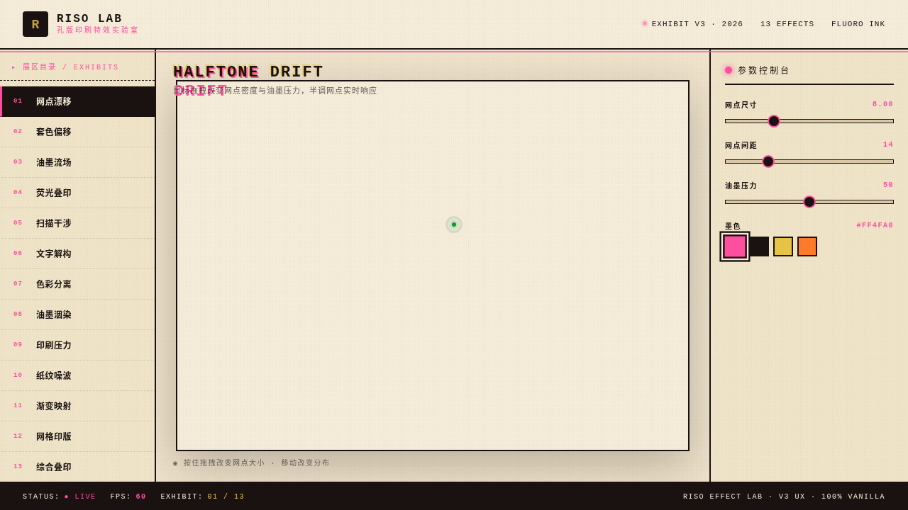

# RISO 孔版印刷特效实验室

- 日期：2026-08-16
- 方向：UX 交互设计（V3）
- 主题：以孔版印刷（Risograph）美学为包装的炫技组件特效装置馆

## 简介
纯 vanilla 单文件实现的特效实验室，13 个展区均为可上手实时操作的组件级特效装置：网点漂移、套色偏移、油墨流场、荧光叠印、扫描干涉、文字解构、色彩分离、油墨洇染、印刷压力、纸纹噪波、渐变映射、网格印版、综合叠印。荧光粉+墨黑+米纸白+芥末黄/荧光橙配色。

## 截图

## 动效亮点
- 自定义光标：白粗环 + 荧光内点 + 多层发光 + difference 混合 + 涟漪
- 每展区独立物理/语义模型：Perlin 噪波流场、油墨扩散、滚筒压力衰减、弹簧/惯性
- 滑块/按钮/开关/色板/拖拽/点击 全部真实可交互
- 13 个展区，视觉冲击力强

## 文件说明
| 文件 | 说明 |
|------|------|
| index.html | 完整可运行源码（纯 vanilla，零依赖） |
| 设计规范.md | 色彩/字体/展区/组件/动效 |
| preview.png | 实验室截图 |

## 妙搭在线预览
https://dcniaqwtmoca.feishu.cn/page/RfWcmbE5xdooKjaNkWCcXVJCnxK

## 技术栈
纯 HTML + CSS + vanilla JS，无 React / 无 Babel / 无外部 CDN。
