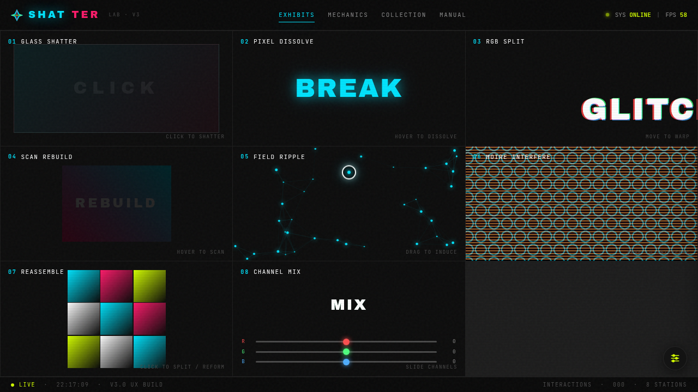

# SHATTER 碎裂特效实验室

> **日期**: 2026-08-16  
> **方向**: V3 UX 交互设计  
> **主题**: 碎裂、崩解、解构、重组 — 炫技组件特效实验室

## 简介

以「碎裂」为核心视觉语言的交互特效实验室。8 个展区均为独立的、视觉冲击力强的组件级特效装置，每个展区必须亲手操作才有意义。

## 展区清单

1. **Glass Shatter** — 点击击碎，裂纹放射扩散、碎片飞溅，自动重组（Radial / Grid / Explode 三模式）
2. **Pixel Dissolve** — 悬停逐像素崩塌，粒子化消散带重力下落
3. **RGB Split** — 鼠标移动驱动三通道错位，随机切片 glitch
4. **Scan Rebuild** — 扫描线掠过逐行重建画面
5. **Field Ripple** — Canvas 粒子场 + 鼠标拖拽静电波纹干涉
6. **Moire Interfere** — 三层摩尔纹/波纹干涉，鼠标控制角度与缩放
7. **Reassemble** — 9 格碎片拼图，点击打散/重组
8. **Channel Mix** — 实时滑块调节 RGB 三通道偏移

## 动效亮点

- 自定义光标（白环+彩点+多层发光+悬停放大+点击涟漪，开屏居中显示）
- 弹簧物理光标跟随（damped spring 积分）
- 磁力按钮（反平方引力）
- 3D 倾斜展台（perspective + rotateX/Y）
- FPS 实时监测
- Canvas 粒子系统（物理模型：速度+重力+衰减）
- 波纹扩散、像素崩解、摩尔干涉、扫描重建
- 打字时钟、数字交互计数

## 文件说明

| 文件 | 说明 |
|------|------|
| `index.html` | 完整源码（纯 vanilla HTML/CSS/JS 单文件） |
| `设计规范.md` | 色彩系统、字体、展区、动效规范 |
| `preview.png` | 页面截图 |
| `thumbnail.png` | 缩略图 |

## 在线预览

[SHATTER 碎裂特效实验室 妙搭应用](https://dcniaqwtmoca.feishu.cn/page/Zvdum0TGVdLqqNaFUnnclQAgnTd)

## 技术栈

纯 vanilla HTML/CSS/JS 单文件（无 React / 无 Babel / 无外部 CDN 依赖）、Canvas 2D 渲染、CSS 变量主题、requestAnimationFrame 统一调度、visibilitychange 自动暂停、prefers-reduced-motion 降级
