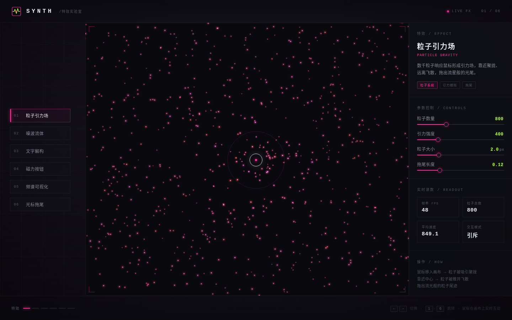

# SYNTH · 特效实验室

> 2026-08-16 · UX 交互设计（V3） · 炫技组件特效动画合集

以「组件级特效」本身为展品的交互实验室——不做物理公式演示，专注视觉冲击力强、逻辑自洽的组件动效。6 个展区全部实时鼠标驱动，纯 vanilla 单文件实现。

## 6 个特效展区

1. **粒子引力场** Particle Gravity — 千颗粒子引力分布 + 拖尾流光，鼠标吸引聚拢 / 近距排斥飞散
2. **噪波流体** Noise Flow Field — Perlin 噪波驱动流线场，鼠标推开留涡旋余迹
3. **文字解构** Text Deconstruction — 点阵文字四散飞开 / 弹簧重组，靠近爆开、离开复原
4. **磁力按钮** Magnetic Buttons — 按钮被光标磁力吸附形变，磁场环可视化
5. **频谱可视化** Audio Spectrum — 霓虹频谱柱 + 环形放射 + 倒影，鼠标高度调振幅
6. **光标拖尾** Cursor Trail — 钻石形粒子自旋消散星云拖尾，移动速度决定生成速率

## 视觉风格

炭黑底 + 霓虹品红 `#FF2E9E` + 酸橙绿 `#B6FF3C` + 银白，合成器波 / 赛博霓虹风。全栈等宽字体（Courier New / Menlo / Consolas）强化实验室仪表感。自定义光标开页即居中显示。

## 文件说明

| 文件 | 说明 |
|---|---|
| `index.html` | 应用源码（单文件，含全部 CSS/JS，64KB） |
| `thumbnail.png` | 桌面端预览截图 |
| `设计规范.md` | 配色 token / 字体 / 展区 / 动效系统 / 健壮性红线 |

## 在线预览

妙搭应用（需分享可见）：https://dcniaqwtmoca.feishu.cn/page/XwN0mjaCOdxus6a3pqTcRLxhnff

## 技术要点

- 纯 vanilla HTML/CSS/JS，零框架依赖，规避妙搭平台 Babel/JSX 白屏
- `visibilitychange` 自动暂停 RAF；切换展区 / 卸载取消全部定时器
- 支持 `prefers-reduced-motion` 降级
- 12+ 组件级特效（粒子拖尾 / 弹簧回弹 / 磁力形变 / 频谱跳动 / 噪波流场 / 文字解构 / 扫描线 / 呼吸光点 / 磁场环纹 / 波纹涟漪 / 选中辉光 / 入场模糊渐入）
