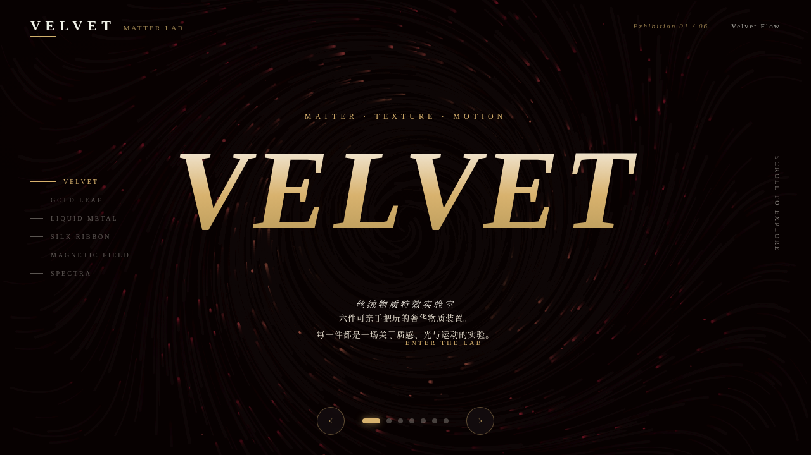

# VELVET 丝绒物质实验室 · 炫技组件特效

> 每日设计 Mock · 2026-08-16 · Batch 6 · V3 UX 交互设计

## 主题

「VELVET 丝绒物质实验室」——以丝绒、金箔、液态金属等奢华物质质感为灵感的炫技组件特效实验室。6 个可亲手把玩的展区，每个展区必须上手操作才有意义。纯 vanilla 单文件实现，零依赖、零白屏风险。

## 配色

深酒红 `#6E1423` · 香槟金 `#D8B26E` · 象牙白 `#F7F2E9` · 炭黑 `#171014`
（严格禁蓝紫渐变）

## 六大展区（全部可亲手把玩）

- **00 VELVET 主视觉**：酒红漩涡粒子 + 鼠标斥力扰动的英雄开场
- **01 丝绒粒子流场**：2400 颗绒粒在 4 重正弦噪波流场中游走，鼠标吸引塑型，可调噪波尺度 / 速度 / 轨迹淡出
- **02 金箔散落**：120 片带自旋的金箔按重力下落，点击绽放一捧金箔，附 3D 倾斜金箔样本卡
- **03 液态金属涟漪**：真实 2D 波动方程迭代，点击 / 按住拖动触发金色涟漪
- **04 绸带拖尾**：三条不同张力的绸带（弹簧-阻尼质点链 + 贝塞尔描边）随光标舞动
- **05 磁性吸附**：6 个可拖动磁极 + 反平方引力 + 180 颗金粒拖尾
- **06 光泽频谱**：64 道合成频谱光束，点击触发和弦粒子爆发，带地平线镜像反射

## 交互说明

- 鼠标移动驱动粒子流场塑型、绸带拖尾、光标外环弹簧跟随
- 点击触发金箔绽放、液态涟漪、频谱和弦爆发
- 展区 5 磁极可拖动，金粒受反平方引力吸附
- 各展区滑块调节参数（噪波尺度 / 速度 / 轨迹淡出等）

## 动效原理说明（远超 12 个组件级特效）

自定义光标（三环弹簧跟随 + 悬停放大变色 + 点击涟漪）、漩涡粒子、噪波流场、金箔重力/自旋/摆动、2D 波动方程、弹簧-阻尼绸带拖尾、反平方引力磁场、频谱柱状图 + peak 保持 + 粒子爆发、打字机标题、数字计数、光泽扫过文字、3D 倾斜样本卡、光泽跟随高光、脉冲光晕、滚动渐入、磁性按钮、金箔光泽闪烁。

**物理模型**：弹簧 Hooke 定律（绸带 / 光标外环）、惯性动量（金箔粒子）、磁性反平方引力（展区 5）、阻尼与摩擦（全链路）、波动方程（液态金属）、RAF 积分器（统一 Raf 管理器）。

## 健壮性

单文件零依赖零白屏、`visibilitychange` 自动暂停 / 恢复 RAF、`pagehide` 统一清理、slider 重建前无残留定时器、高频 `mousemove` 直接操作 DOM transform、`prefers-reduced-motion` 全量降级、响应式适配移动端。

## 截图



## 在线预览

https://dcniaqwtmoca.feishu.cn/page/UJvhmpvAEdnWh5anzIZc6srLn1f

## 文件结构

```
2026-08-16_VELVET_丝绒物质实验室/
└── index.html              # 纯 vanilla 单文件（HTML+CSS+JS 内联，95K）
```

## 本地运行

直接用浏览器打开 `index.html`，无需任何依赖与构建。
