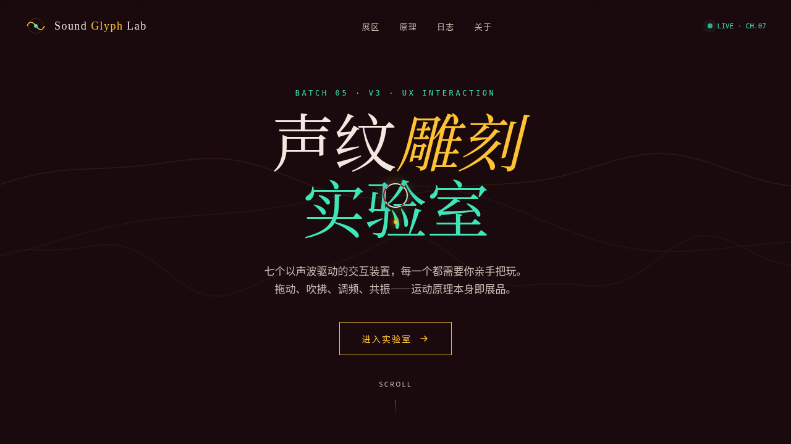

# 声纹雕刻 Sound Glyph

> Arc 每日设计 Mock · 2026-08-16 batch5 · V3 UX 交互设计



## 在线预览

https://dcniaqwtmoca.feishu.cn/page/UIuZm9xOFdVI6SaCjTNckw9qnIc

## 概述

以「声波驱动形变」为母题的炫技组件特效实验室，7 个展区每个都必须亲手把玩：拖动声源雕刻粒子、吹动声场推动字符、调节频率看驻波、按声波按钮……交互运动原理本身即展品。

- **方向**：UX 交互设计（可把玩实验室）
- **主题**：声波驱动形变
- **配色**：深酒红 #1a0a0e + 暖金 #ffc233 + 薄荷青 #3ee6b8 + 暖白 #f2e8e0（无蓝紫渐变）
- **实现**：纯 vanilla 单文件 HTML+CSS+JS，无 React/Babel/CDN 依赖

## 交互说明

- **01 波形雕刻器**：拖动声源，288 个粒子随相位被正弦波雕刻。
- **02 声场吹字**：鼠标反平方斥力吹散字符，松手弹簧回位。
- **03 驻波频率**：滑动频率观察驻波，谐波处标记波节/波腹。
- **04 声波按钮**：触发多圈同心涟漪，频率对应音高，叠加干涉。
- **05 频谱粒子场**：64 根频谱柱驱动 300 粒子，点击产生冲击波。
- **06 共振钟摆**：拖动释放后弹簧阻尼衰减振荡，薄荷轨迹记录路径。
- **07 声纹签名**：7 层正弦波叠加生成独一声纹。
- 自定义光标开页居中显示，悬停展区形态变化。

## 动效原理

详见 [设计规范.md](./设计规范.md)。12+ 组件级特效，基于物理模型（正弦波叠加、驻波方程、Hooke 弹簧、阻尼振荡、反平方斥力、RAF 积分器）。

## 健壮性

- 纯 vanilla 单文件，无 React/Babel/CDN（一次成功无白屏）。
- RAF 随 visibilitychange 暂停；卸载取消。
- 高频 mousemove 直接 DOM transform，不重渲染。
- 支持 prefers-reduced-motion。

## 文件结构

```
2026-08-16_声纹雕刻_sound-glyph/
├── index.html
├── preview.png
├── 设计规范.md
└── README.md
```

## 本地运行

直接用浏览器打开 `index.html`；或 `python3 -m http.server` 后访问。
