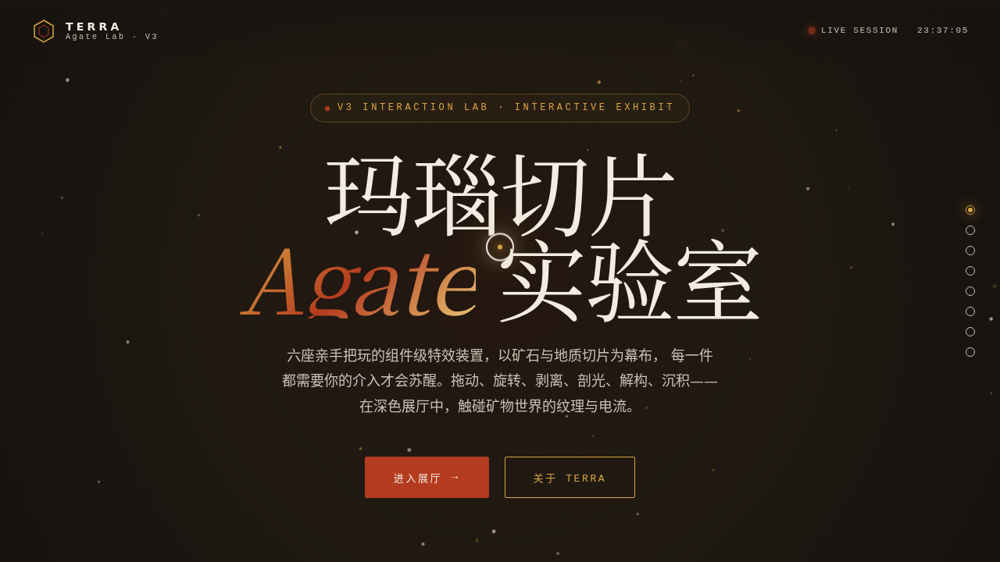

# TERRA 玛瑙切片实验室 · V3 UX 交互设计

- 日期：2026-08-16
- 方向：V3 UX 交互设计
- 主题：矿石与地质切片的炫技组件特效实验室
- 配色：玄武岩黑 #17130F + 玛瑙赭红 #B43A1E + 石英乳白 #F2ECE2 + 金脉 #D9A441

## 简介

「TERRA 玛瑙切片实验室」是一座可亲手把玩的特效装置舱，6 个展区均为独立的组件级特效装置：玛瑙同心纹生长画布、晶体 3D 旋转矩阵、岩层剥离视差剖面、剖光扫过光泽流、矿脉电流文字、砂砾沉积粒子。每个展区必须上手操作才有意义。纯视觉炫技，非物理公式演示。

## 动效亮点

- 自定义光标：白环 + 金点 + 发光，悬停三态变形，点击涟漪
- 玛瑙同心纹拖动生长（路径密度随速度变化）
- 晶体 3D 拖拽旋转 + 惯性滑行 + 摩擦衰减
- 矿脉电流文字（Canvas 电流束随机闪烁传递）
- 砂砾沉积粒子（重力 + 安息角堆积）
- 共 12+ 组件级特效

## 妙搭在线预览

https://dcniaqwtmoca.feishu.cn/page/I59ZmXfaldLci1asqiCcZS3Enht

## 截图

## 文件说明

| 文件 | 说明 |
|---|---|
| index.html | 完整源码（纯 vanilla 单文件，无外部依赖） |
| thumbnail.png | 页面截图 |
| 设计规范.md | 色彩/字体/展区/动效规范 |

## 技术栈

纯 vanilla HTML/CSS/JS 单文件（无 React / 无 Babel / 无外部 CDN），原生 RAF 动效，运行于妙搭 html 应用。
