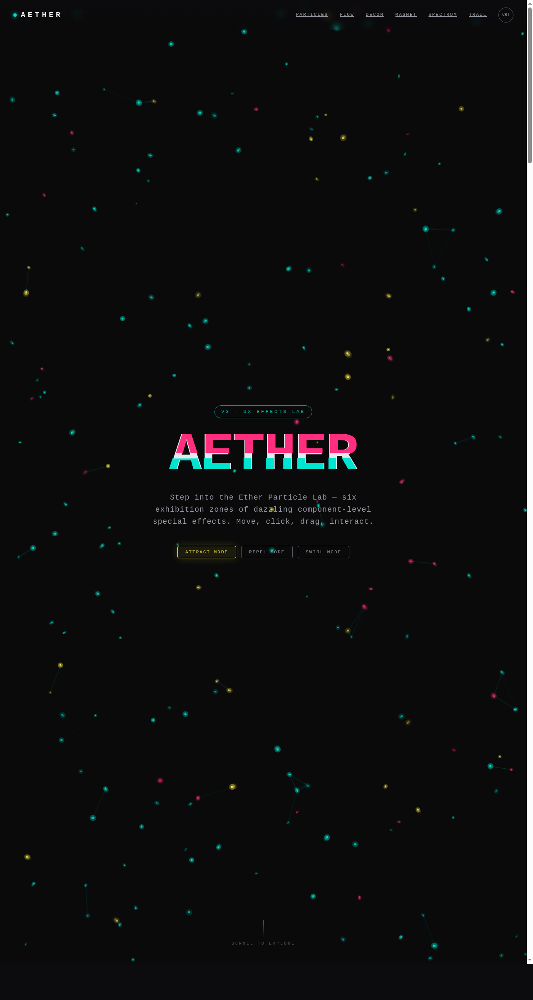

# AETHER 以太粒子实验室

日期：2026-08-17 · 方向：V3 UX 交互设计 · 主题：炫技组件特效动画可把玩实验室

## 简介

以「炫技组件特效动画」为展品的可亲手把玩实验室，6 个独立展区均为视觉冲击力强的组件级特效装置，每个展区必须上手操作（鼠标移动/点击/拖动/滑动）才成立。无物理公式演示，纯视觉炫技。

## 配色

炭黑 #0C0C0E 底 + 电青 #00E5D0 主色 + 品红 #FF2E7E 强调 + 柠黄 #F0E040 点缀 + 银白 #E8E8EC 文字。三原色光效在炭黑底上叠加。

## 截图

## 展区

1. 以太粒子场（吸引/排斥/漩涡三模式）
2. 噪波流场（FBM 噪声驱动，点击换种子）
3. 文字解构重组（推开/波浪/粉碎三模式，弹簧回弹）
4. 磁力形变卡片（反平方引力，三档强度）
5. 频谱可视化（64 柱，BPM 可调）
6. 光标拖尾（彩虹/纯青/火焰三模式）

## 动效亮点

自定义光标（惯性外环 + 点击涟漪）、粒子连线网、噪声流场、文字粒子弹簧、磁力形变、频谱柱渐变、拖尾辉光、扫描线 CRT 滤镜、Glitch 文字、卡片聚光灯——基于弹簧/反平方引力/阻尼/RAF 积分器等物理模型。

## 文件说明

| 文件 | 说明 |
|------|------|
| index.html | 完整可运行源码（纯 vanilla 单文件） |
| preview.png | 页面截图 |
| 设计规范.md | 色彩/展区/动效/健壮性规范 |

## 在线预览

https://dcniaqwtmoca.feishu.cn/page/ULbemcr1ndM6GcaVhdScvdf2nk5

## 技术栈

纯 vanilla HTML/CSS/JS 单文件，无 React/Babel/CDN 依赖。
