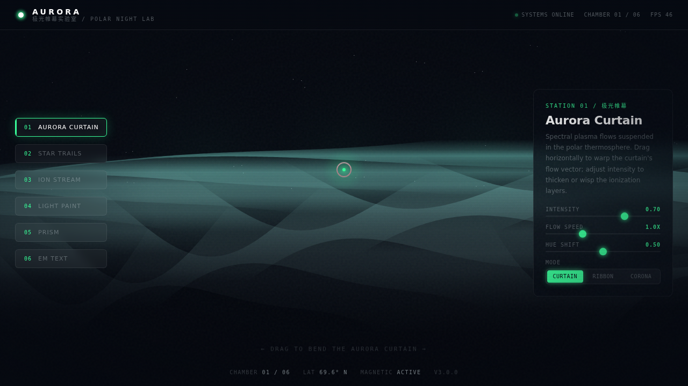

# AURORA 极光帷幕实验室

- **日期**：2026-08-17
- **方向**：V3 UX 交互设计
- **主题**：极夜天象主题的炫技特效舱——6 个可亲手操作的组件级特效装置
- **配色**：极夜黑 `#060A12` + 极光绿 `#39FF9A` + 冰青 `#7FE7DC` + 暖粉 `#FF8FB2` + 银灰 `#B8C4C9`（无蓝紫渐变）

## 简介

纯 vanilla 单文件实现的极光主题特效实验室。6 个展区（极光帷幕 / 星轨拖尾 / 离子粒子流 / 光绘涂鸦 / 光谱折射棱镜 / 电磁波文字解构）每个都配参数滑杆与模式切换，上手玩才有意义。左右方向键或左侧导航切换展区。

## 截图

## 动效亮点

12+ 组件级特效：自定义光标、极光帷幕 shader 流场、星轨长曝光、离子粒子平方反比力场、光绘衰减、棱镜 Snell 折射色散、文字弹簧解构、磁吸导航、视差面板、扫描线滤镜+暗角+噪点、脉动徽标、流光按钮、FPS 监测。

## 在线预览
- 妙搭应用：https://dcniaqwtmoca.feishu.cn/page/Hs0EmJusldf3NsaN2RXcwpkNnvf

## 文件说明
| 文件 | 说明 |
|------|------|
| index.html | 完整可运行源码（纯 vanilla HTML/CSS/JS 单文件，零依赖） |
| 设计规范.md | 色彩系统、字体、6 展区、动效系统、工程特性 |
| preview.png / thumbnail.png | 实验室界面截图 |

## 技术栈
纯 vanilla HTML/CSS/JS 单文件（无 React / 无 Babel / 无 CDN）、Canvas 2D、单 RAF 统一调度、prefers-reduced-motion 降级。
