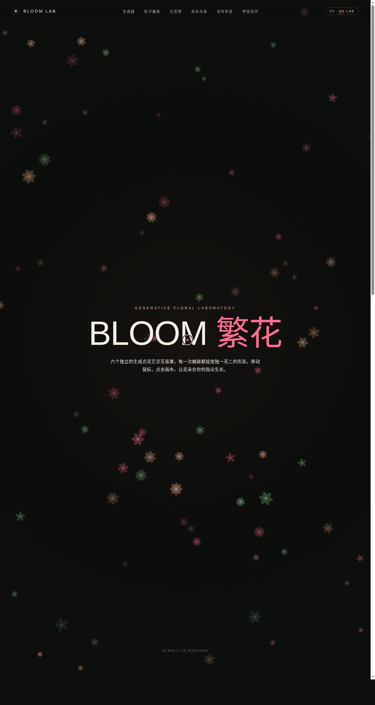

# BLOOM 繁花生成实验室

> 日期：2026-08-17 ｜ 方向：V3 UX 交互设计 ｜ 主题：生成式繁花炫技组件特效实验室

## 简介

以生成式繁花 / 花瓣 / 花丝为视觉母题的炫技组件特效实验舱，6 个展区每个都是可亲手把玩的组件级特效装置：繁花生成器（点击生成参数化花朵）、花瓣粒子爆发（拖拽喷射，重力 / 漂浮双模式）、万花筒绽放（镜像对称，鼠标控速）、花丝光束（弹性花丝弹簧物理跟随鼠标）、花阵形变场（网格花朵磁力形变，全宽旗舰展区）、呼吸花环（双环律动 + 频谱条）。炭黑底 + 珊瑚粉 / 蜜桃 / 叶绿 / 奶白配色，无蓝紫渐变。纯 vanilla 单文件实现。

## 截图

## 动效亮点

自定义光标（开屏居中，白环 + 珊瑚粉内点 + 拖尾轨迹）、繁花参数化生成、花瓣粒子爆发、万花筒镜像绽放、弹性花丝光束（弹簧物理）、花阵磁力形变、呼吸花环律动、频谱条、滚动渐入、展区切换过渡、粒子拖尾、悬停光晕——共 12+ 组件级特效，全部基于物理模型或花朵语义，无整图缩放。支持 `prefers-reduced-motion` 降级；统一动画循环管理器随 `visibilitychange` 暂停、卸载清理。

## 文件说明

| 文件 | 说明 |
|---|---|
| index.html | 完整源码（纯 vanilla HTML/CSS/JS 单文件） |
| preview.png | 页面截图（1280×2400） |
| thumbnail.png | 平台缩略图 |
| 设计规范.md | 色彩 / 字体 / 组件 / 动效 / 页面结构规范 |

## 妙搭在线预览

https://dcniaqwtmoca.feishu.cn/page/RJeFmjCPCdJROsaN4awcNuhMnBg

## 技术栈

纯 vanilla HTML/CSS/JS 单文件，零 React / 零 Babel / 零外部 CDN 依赖。Canvas + DOM 混合渲染。
