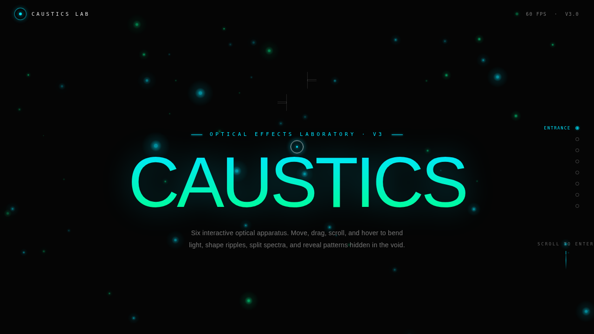

# CAUSTICS 焦散光影实验室

> 日期：2026-08-17 · 方向：V3 UX 交互设计 · 主题：焦散光影特效实验室

「CAUSTICS 焦散光影实验室」是一个以光线穿过水面或玻璃产生的焦散（聚焦光束）为灵感的特效实验室。包含 6 个可亲手把玩的交互展区：水面焦散、棱镜折射、光池汇聚、彩虹散色、光线隧道、扫描线焦散。每个展区基于物理模型或光学原理，必须上手操作才有意义。

## 截图

## 展区

1. **水面焦散** — 鼠标移动产生涟漪，光线穿过涟漪形成焦散光纹（2D 波动方程）
2. **棱镜折射** — 拖动滑块调入射角，白色光束分解成七色光谱（Snell 定律色散）
3. **光池汇聚** — 1200 粒子被鼠标吸引汇聚，形成聚焦光斑（反平方引力 + 阻尼）
4. **彩虹散色** — 拖拽绘制色带，颜色沿轨迹扩散混合（色相循环 + screen blend）
5. **光线隧道** — 滚动穿越同心光环隧道，速度越快环越形变（弹簧 + 惯性）
6. **扫描线焦散** — 4 种模式逐行显影，已显影区域缓慢衰减

## 动效亮点

- 自定义光标（弹簧跟随 + 悬停缩放 + 点击涟漪）
- 水面波纹物理模拟（波动方程数值积分）
- 1200 粒子引力系统（反平方引力 + RAF 积分器）
- 棱镜光谱折射（Snell 定律色散）
- 同心环弹性形变（弹簧 Hooke 定律 + 惯性）
- 扫描线显影（4 种模式切换）
- 单 RAF 主循环 + IntersectionObserver 分区激活

## 在线预览

[CAUSTICS 焦散光影实验室](https://dcniaqwtmoca.feishu.cn/page/WRwhmHGO7dQMTYaSPBbc7DUrnLc)

## 文件说明

| 文件 | 说明 |
|------|------|
| index.html | 完整可运行的源代码（纯 vanilla HTML/CSS/JS 单文件） |
| preview.png | 页面截图 |
| thumbnail.png | 缩略图 |
| 设计规范.md | 设计规范文档 |

## 技术栈

纯 vanilla HTML/CSS/JS 单文件实现，无 React/无 Babel/无外部 CDN 依赖。Canvas 2D API + requestAnimationFrame + IntersectionObserver，支持 prefers-reduced-motion 降级。
