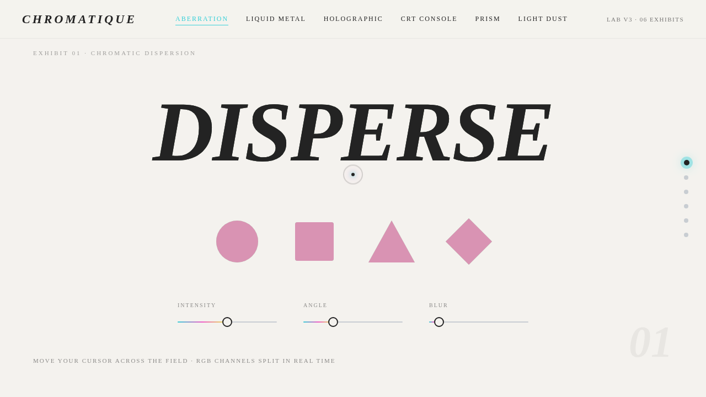

# CHROMATIQUE 液态光学实验室 · UX 交互设计

- 日期：2026-08-17
- 方向：V3 UX 交互设计
- 主题：CHROMATIQUE —— 光与色散的组件特效把玩实验室
- 配色：珍珠白 #F4F2EE / 石墨黑 #232323 / 电镀银 #C8CDD2 + 全息彩虹（青 #39D0D8 / 品红 #F05CC8 / 柠檬黄 #E8F04A）（禁蓝紫渐变）

## 简介

一座关于「光与色散」的组件特效把玩实验室。6 个独立展区，每个都是可亲手操作的、视觉冲击力强的组件级特效装置：色散 RGB 分离、液态金属推挤形变、全息箔 3D 倾斜、CRT 扫描线滤镜控制台、棱镜折射光谱分解、体积光尘扰动。每个展区提供滑杆/开关/拖拽等真实可调参数。

## 截图

## 动效亮点

- 色散 RGB 通道分离（鼠标距离驱动分离量）
- 液态金属推挤形变（表面张力 + 粘度物理）
- 全息箔 3D 倾斜 + 彩虹干涉色带
- CRT 扫描线/闪烁/渐晕/曲率/色偏实时滤镜
- 棱镜折射 12 色光谱分解
- 体积光尘粒子扰动（鼠标力场）
- 自定义光标 + 点击涟漪
- 横向滑动导航 + 石墨色 wipe 转场
共 ≥12 项组件级特效，均基于物理/光学语义。

## 妙搭在线预览

https://dcniaqwtmoca.feishu.cn/page/R929ml0Awdw8zQaTNNHc3t2hnxe

## 文件说明

| 文件 | 说明 |
|---|---|
| index.html | 完整可运行源码（纯 vanilla 单文件） |
| preview.png | 页面截图 |
| thumbnail.png | 缩略图 |
| 设计规范.md | 色彩 / 字体 / 展区 / 动效规范 |

## 技术栈

纯 HTML + CSS + 原生 JS（vanilla 单文件），无 React / 无 Babel / 无外部 CDN 依赖。
