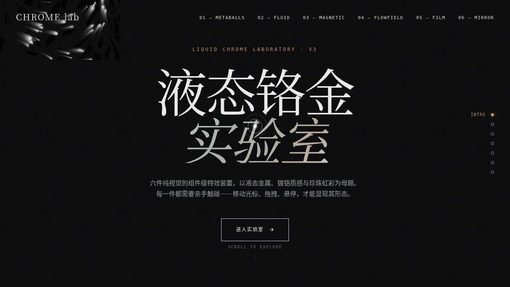

# CHROME 液态铬金实验室

- 日期：2026-08-17
- 方向：V3 UX 交互设计
- 主题：液态金属 / 镀铬质感组件特效实验室

## 简介

以液态金属与镀铬质感为母题的可亲手把玩特效实验室，6 个独立展区：液态金属 Metaball 聚合、镀铬流体文字形变、磁力液态按钮、金属颗粒流场、虹彩薄膜干涉、镜面反射光标拖尾。每个展区配可交互参数滑块或直接指针交互。

## 截图

## 动效亮点

自定义光标（三环白环+彩色内点+多层发光+悬停形变+点击涟漪，开页即居中）；6 个展区各基于独立物理模型（弹簧+反平方引力 / 弹簧阻尼振荡 / Perlin 噪波向量场 / conic-gradient 旋转 / 逐帧衰减色散）；共享 RAF 管理器随可见性暂停，视口外不跑动画。

## 妙搭在线预览

https://dcniaqwtmoca.feishu.cn/page/Jw7tm3HY8dUKLWaUwgOciSd8nbc

## 文件说明

| 文件 | 说明 |
|------|------|
| index.html | 完整可运行源码（纯 vanilla 单文件） |
| 设计规范.md | 色彩系统 / 字体 / 展区 / 动效 / 健壮性 |
| thumbnail.png | 页面截图 |

## 技术栈

纯 vanilla HTML/CSS/JS 单文件（零 React / Babel / CDN 依赖）。配色：石墨黑 / 铬银 / 珍珠虹彩 / 铜色点缀。
