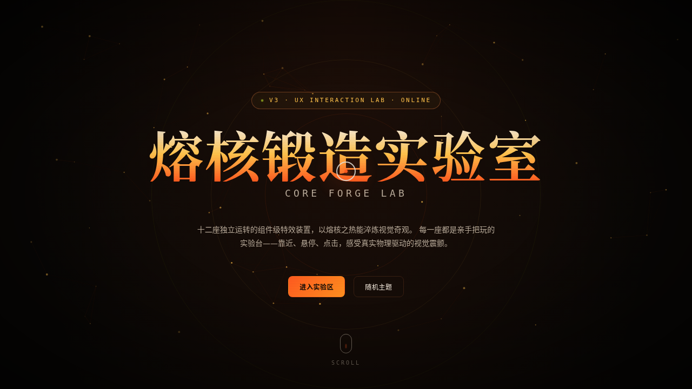

# 熔核锻造实验室 Core Forge Lab

> 日期：2026-08-17 · 方向：V3 UX 交互设计 · 主题：熔核锻造炫技组件特效实验室

## 简介

「Core Forge Lab 熔核锻造实验室」是一个以炫技组件特效动画为展品的可亲手把玩实验室。12 座独立特效装置（噪声流场、磁力形变、文字解构、频谱可视化、3D 倾斜卡片、打字机计数、轨道粒子、液态形变、故障艺术、液态进度球、熔核万花筒、透视网格地平线）+ 全局光标/拖尾/环境粒子/视差系统。黑曜岩底 × 熔橙 × 流金 × 电光柠绿配色，完全避开蓝紫渐变。

## 截图

## 动效亮点

- 自定义光标（白环+熔橙内点+三层辉光+三态切换+涟漪）+ 光标拖尾粒子
- 噪声流场（Simplex 向量场 + 光标斥力扰动）
- 磁力形变按钮（反平方引力 + 弹簧阻尼回弹）
- 文字解构（每字符独立弹簧质点，周期各异）
- 频谱可视化（32 柱正弦叠加 + 节拍冲击）
- 液态形变 / 液态进度球 / 熔核万花筒 / 透视网格地平线
- 环境粒子背景（连线 + 鼠标反平方斥力）+ 扫描线暗角

## 文件说明

| 文件 | 说明 |
|------|------|
| index.html | 完整可运行源码（纯 vanilla HTML/CSS/JS 单文件） |
| 设计规范.md | 色彩、字体、展区、动效物理依据、健壮性 |
| preview.png | 页面截图 |

## 妙搭在线预览

https://dcniaqwtmoca.feishu.cn/page/OtbdmrvHtdNT9la12SycURtknCd

## 技术栈

纯 vanilla HTML/CSS/JS 单文件（无 React / 无 Babel / 无外部 CDN 依赖）。
