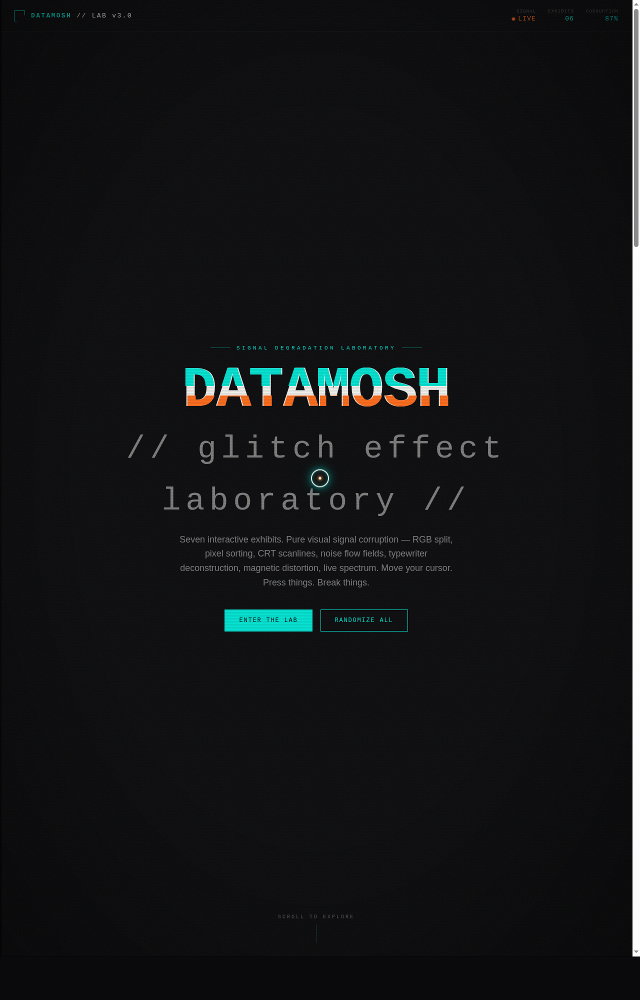

# DATAMOSH 数据故障实验室

> 日期：2026-08-17 · 方向：V3 UX 交互设计 · 主题：数字信号故障美学特效实验室

## 简介

「DATAMOSH」是一座可亲手把玩的数据故障美学特效实验室，包含 7 个独立展区：RGB 通道分离、Canvas 像素排序腐蚀、CRT 扫描线显示器、600 粒子噪波流场、故障打字机、磁性故障按钮、64 频段频谱可视化。每个展区必须上手操作才有意义——移动鼠标、拖动参数、点击爆裂，感受数字信号故障的视觉冲击。

## 截图

## 动效亮点

- 自定义光标：白环 + 故障橙内点 + 8 粒拖尾 + 多层发光 + 点击涟漪
- RGB 通道分离文字（鼠标驱动青/橙双通道偏移）
- 真实 Canvas 像素排序图像腐蚀（4 预设 + 行位移故障）
- 600 粒子噪波流场 + 鼠标反平方斥力
- CRT 扫描线 + 32 柱频谱 + 故障打字机
- 磁性按钮反平方引力 + 点击三色粒子爆裂
- 64 频段频谱可视化等共 14+ 组件级特效

## 配色

碳黑 `#0A0A0C` + 信号青 `#00E5D4` + 噪点白 `#F2F2EE` + 故障橙 `#FF6B1A`（禁用蓝紫渐变）。

## 文件说明

| 文件 | 说明 |
|---|---|
| `index.html` | 完整可运行源码（纯 vanilla HTML/CSS/JS 单文件） |
| `preview.png` | 桌面端截图（1280×2000） |
| `thumbnail.png` | 平台生成缩略图（720×1280） |
| `设计规范.md` | 色彩 / 字体 / 展区 / 动效 / 健壮性规范 |
| `README.md` | 本说明文件 |

## 在线预览

妙搭在线预览链接：https://dcniaqwtmoca.feishu.cn/page/QE0xmIUR7dAKpwa8BvXch6aynzd

## 技术栈

纯 vanilla HTML/CSS/JS 单文件实现，无 React / 无 Babel / 无外部 CDN 依赖；Canvas 2D 像素操作 + SVG 滤镜 + RAF 动画循环原生实现，支持 `prefers-reduced-motion` 降级与 `visibilitychange` 自动暂停。
