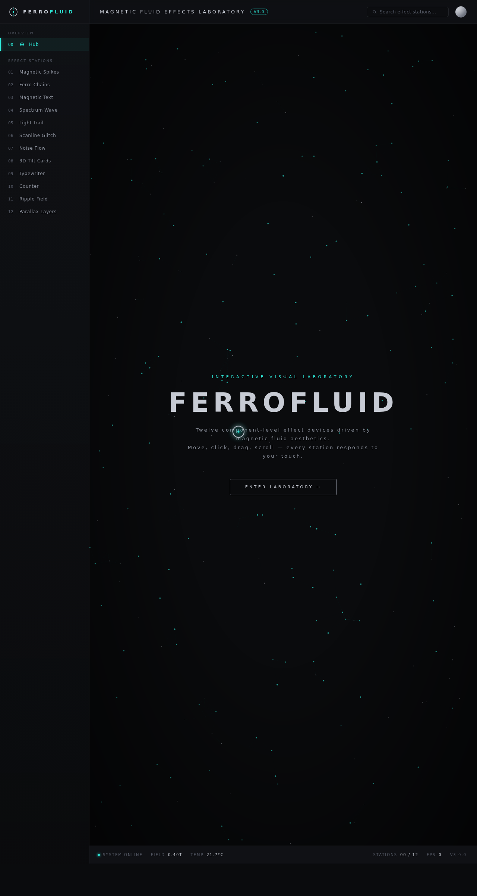

# FERROFLUID 磁流体实验室

- 日期：2026-08-17
- 方向：V3 UX 交互设计
- 主题：以铁磁流体为视觉母题的炫技特效实验室

## 简介

12 个可亲手把玩的组件级特效装置：磁流体尖峰、铁磁粒子链、磁化文字解构、频谱磁浪、光绘拖尾、扫描线 glitch、噪波流场、3D 倾斜卡、终端打字机、数字计数、涟漪场、四层视差。配色取炭黑 + 汞银 + 电青。

## 截图

## 动效亮点

- 磁流体尖峰弹簧物理 + 鼠标牵引点击脉冲
- 铁磁粒子链反平方引力 + 惯性阻尼连线
- 光绘拖尾多层辉光 + 速度感知 + 点击爆裂
- 扫描线 glitch RGB 分离 + 噪声爆发

## 在线预览

https://dcniaqwtmoca.feishu.cn/page/ZyAhm3C4kdGOTIaH7jZc76T0npf

## 文件说明

| 文件 | 说明 |
|---|---|
| index.html | 完整可运行纯 vanilla 单文件源码 |
| preview.png | 页面截图 |
| thumbnail.png | 平台缩略图 |
| 设计规范.md | 色彩 / 字体 / 展区 / 动效规范 |

## 技术栈

纯 HTML / CSS / 原生 JS 单文件，无 React / Babel / 外部 CDN 依赖。
