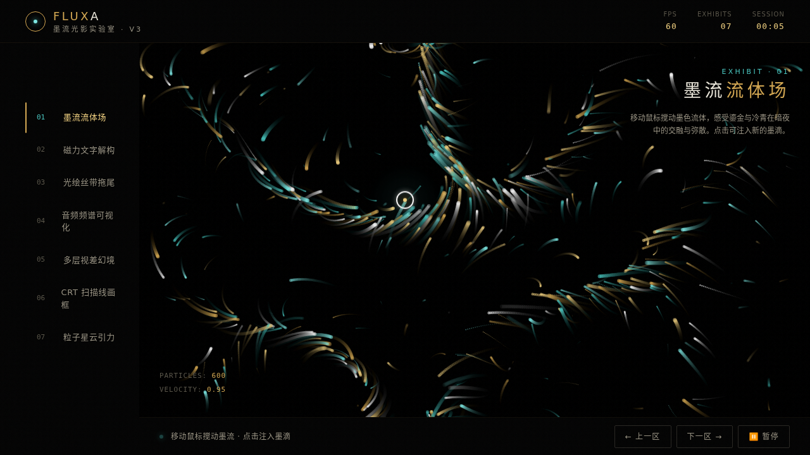

# FLUXA 墨流光影实验室

> 日期：2026-08-17 · 方向：V3 UX 交互设计 · 主题：墨流光影炫技组件特效实验室

以「炫技组件特效动画」为展品的可亲手把玩实验室，7 个独立展区，每个展区上手操作才有意义。漆黑 + 鎏金 + 冷青配色体系。

## 截图

## 展区

1. 墨流流体场 — 600 粒子噪声流场 + 鼠标反平方斥力 + 涡旋搅动 + 点击墨滴爆发
2. 磁力文字解构 — 像素采样粒子 + 斥力推开 + 胡克定律弹簧归位
3. 光绘丝带拖尾 — 三层加性混合光带 + 4 种预设配色
4. 音频频谱可视化 — Web Audio 合成 3 首音轨 + 麦克风输入 + 64 频带镜像柱图
5. 多层视差幻境 — 7 层东方水墨夜境视差
6. CRT 扫描线画框 — 三旋钮可调 + 扫描线 + 荧光闪烁 + 暗角 + 示波器
7. 粒子星云引力 — 800 粒子反平方吸附 + 点击冲击波

## 动效亮点

- 自定义光标：白粗环 + 鎏金内点 + 冷青外晕，独立惯性，悬停变色，点击涟漪
- 全部基于物理模型（弹簧 / 反平方引力斥力 / 阻尼 / RAF 积分器）
- 全局单一 RAF 循环 + 注册表，visibilitychange 暂停，卸载清理

## 在线预览

https://dcniaqwtmoca.feishu.cn/page/Q8Knm4Phtdt1nHaqUOEcxKapnUd

## 文件说明

| 文件 | 说明 |
|------|------|
| index.html | 完整可运行源码（纯 vanilla HTML/CSS/JS 单文件） |
| 设计规范.md | 色彩系统、字体、展区、动效、健壮性 |
| thumbnail.png | 页面截图 |

## 技术栈

纯 vanilla HTML/CSS/JS 单文件实现，无 React / 无 Babel / 无外部 CDN 依赖。
