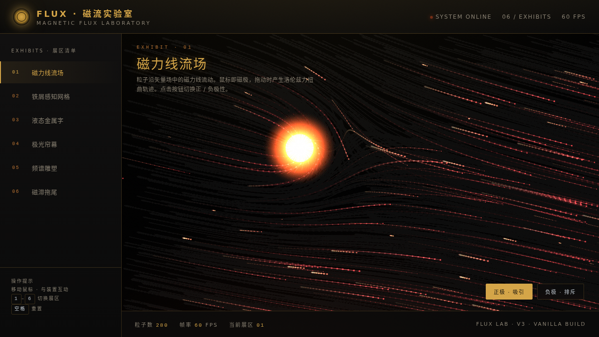

# FLUX 磁流实验室 · V3 UX 交互设计

> 日期：2026-08-17 ｜ 方向：V3 UX 交互设计 ｜ 主题：磁力线/场域扭曲炫技组件特效实验室

## 简介

「FLUX 磁流实验室」是一个以磁力线/场域扭曲/铁屑感知为主题的炫技组件特效实验室，6 个独立装置可亲手把玩：磁力线流场（粒子沿矢量场流动，鼠标即磁极可切换极性）、铁屑感知网格（弹簧 Hooke 偏转回摆）、液态金属字（feTurbulence displacement 实时形变）、极光帘幕（噪声场波动 + 鼠标拨开涟漪）、频谱雕塑（Web Audio AnalyserNode + 弹簧积分）、磁滞拖尾（速度拉伸 + 衰减凝聚）。炭黑底 + 鎏金/血橙/冷银金属质感。

## 截图

## 动效亮点

- 自定义光标：白环 + 鎏金内点 + 多层发光，中心即显，悬停变形 + 点击涟漪
- 磁力线粒子流场（矢量场 + 洛伦兹力，280 粒子）
- 铁屑偏转对齐（弹簧 Hooke + RAF 积分）
- 液态金属字 feTurbulence displacement 实时形变
- 极光帘幕噪声场波动 + 鼠标拨开涟漪
- 频谱柱弹簧积分弹性起伏（Web Audio）
- 磁滞拖尾速度拉伸 + 衰减凝聚光环

全部基于物理模型（磁力反平方 / 弹簧 Hooke / 惯性 / 阻尼 / RAF 积分器），周期各异，禁 Ken Burns。

## 操作方式

数字键 `1–6` 切换展区，`空格` 重置当前装置，鼠标直接与每台装置互动。

## 文件说明

| 文件 | 说明 |
|------|------|
| index.html | 完整可运行源码（纯 vanilla 单文件） |
| 设计规范.md | 色彩系统、字体、组件、动效系统 |
| preview.png / thumbnail.png | 页面截图 |
| README.md | 本说明文件 |

## 妙搭在线预览

https://dcniaqwtmoca.feishu.cn/page/K7ZOmvaZmdcKjnarAMFcqDkInmQ

## 技术栈

纯 vanilla HTML/CSS/JS 单文件，无 React、无 Babel、无外部 CDN 依赖。
