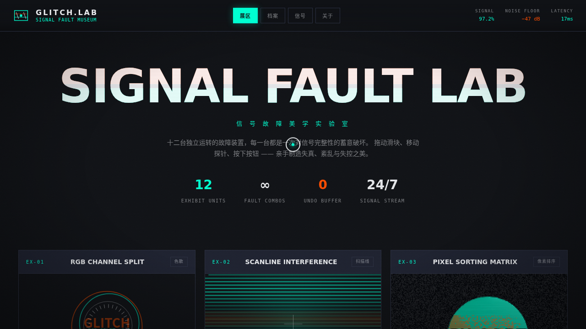

# GLITCH 信号故障实验室 · V3 UX 交互设计

> 日期：2026-08-17 ｜ 方向：V3 UX 交互设计 ｜ 主题：故障艺术（Glitch Art）组件特效实验室

## 简介

以信号故障 / 故障艺术为主题的「可亲手把玩」特效实验室。12 台故障视觉装置，每台都是独立的、视觉冲击力强的组件级特效，必须上手调节参数 / 拖拽 / 移动光标才有意义。纯视觉炫技，非物理公式演示。

## 截图

## 动效亮点

- 自定义光标：白环 + 信号青内点 + 橙色悬停态 + 多层发光，开页即显屏幕中央，点击涟漪
- 12 台装置：RGB 通道分离 / 扫描线干涉 / 像素排序 / 数据弯折 / 字符乱流 / VHS 撕裂 / 磁力形变 / 频谱故障 / 位压缩 / 波形故障 / 马赛克解码 / 拖尾残影
- 统一 rAF 循环驱动，参数实时影响 Canvas 渲染
- 磁力形变基于反平方引力模型

## 配色

炭黑 `#101216` + 信号青 `#00FFD1` + 警示橙 `#FF4D00` + 银白 `#E8EAED`（故障艺术系，无蓝紫渐变）。

## 文件说明

| 文件 | 说明 |
|---|---|
| index.html | 完整可运行单页源码（纯 vanilla，无外部依赖） |
| 设计规范.md | 色彩 / 字体 / 12 台装置 / 动效 / 健壮性 |
| thumbnail.png | 预览截图 |

## 妙搭在线预览

https://dcniaqwtmoca.feishu.cn/page/Vbr0mitktdU8UwaGUWBcW1DfnPf

## 技术栈

纯 vanilla HTML / CSS / JS 单文件实现（无 React / 无 Babel / 无外部 CDN 依赖）+ Canvas / RAF。
