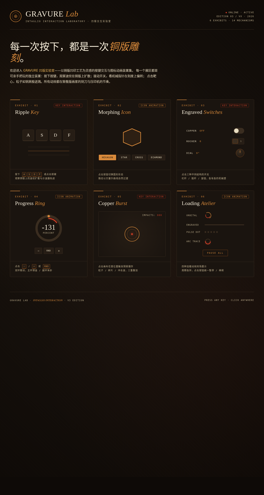

# GRAVURE 凹版实验室

> 日期：2026-08-17 · 方向：V3 UX 交互设计 · 主题：铜版凹印工艺交互实验室

以铜版凹印工艺为灵感的按键交互与可视化图标动画实验室，6 个可亲手把玩的独立展区，深墨底 + 铜金 + 朱砂红配色。

## 动效亮点

- Ripple Key：`A`/`S`/`D`/`F` 按键波纹扩散 + 示波器轨迹滚动
- Morphing Icon：点击切换 Hexagon / Star / Cross / Diamond 四态 SVG 路径变形
- Engraved Switches：杠杆 / 摇杆 / 旋钮三种开关各异机械动画
- Progress Ring：双环联动进度环 + 数字滚动 + 高值色变（铜金→金叶→朱砂）
- Copper Burst：点击画布三重爆炸（冲击波环 + 圆形粒子 + 碎片）
- Loading Atelier：四种加载动效同场（轨道 / 刻线 / 脉冲点阵 / 弧线追踪）

## 文件说明

| 文件 | 说明 |
|------|------|
| index.html | 完整可运行源码（纯 vanilla 单文件） |
| 设计规范.md | 色彩 / 字体 / 展区结构 / 动效机制 |
| preview.png | 页面截图 |
| thumbnail.png | 缩略图 |

## 妙搭在线预览

https://dcniaqwtmoca.feishu.cn/page/Iyzfmh4Dxdix17aikGYcnYVinuf

## 技术栈

纯 vanilla HTML / CSS / JavaScript 单文件，无 React / Babel / CDN 依赖。
