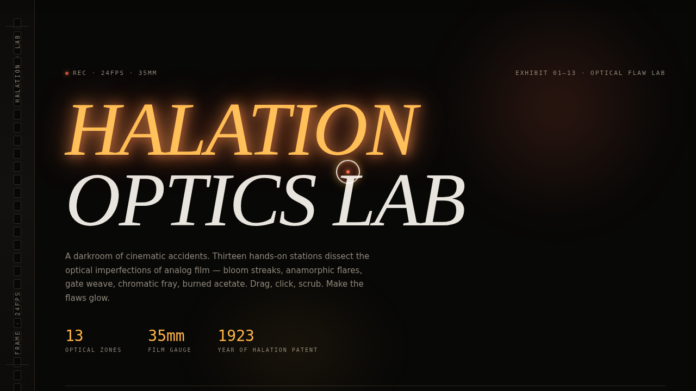

# HALATION 光晕实验室 · V3 UX 交互设计 Mock

> 日期：2026-08-17 ｜ 方向：V3 UX 交互设计 ｜ 主题：胶片光晕/镜头炫光特效装置

## 简介

以胶片摄影光学瑕疵为灵感的炫技特效实验室。13 个展区，每个是一件可亲手操作的组件级特效装置：光晕 Bloom、变形宽银幕拉丝炫光、乳剂颗粒、胶片灼烧转场、片门抖动、色边色差、暖调漏光、尘埃划痕、快门闪烁、镜头暗角、光圈球磁力、棱镜频谱、磁力字形。炭黑底 + 暖琥珀 + 玫瑰光晕橙红，左侧齿孔胶片导轨作签名元素。

## 截图

## 动效亮点

- 自定义光标：白环 + 琥珀内点 + 玫瑰光晕，悬停放大变色、点击涟漪
- Halation Bloom 五层同心光晕跟随可拖动光源
- Anamorphic 横向拉丝光斑跟随指针速度
- 胶片灼烧转场 + 火星粒子
- 24 颗光圈球磁力吸引/排斥（反平方引力模型）
- 字母受光标磁力场形变
- 齿孔胶片导轨帧推进光点

## 妙搭在线预览

https://dcniaqwtmoca.feishu.cn/page/O2fwmN70IdvYniaNTH4cld5AnUc

## 文件说明

| 文件 | 说明 |
|---|---|
| index.html | 完整可运行源码（纯 vanilla 单文件，含内联 CSS/JS） |
| preview.png | 页面截图 |
| 设计规范.md | 色彩系统、字体、展区、动效规范 |

## 技术栈

纯 vanilla HTML/CSS/JS 单文件，零 React/Babel/CDN 依赖；支持 prefers-reduced-motion。
