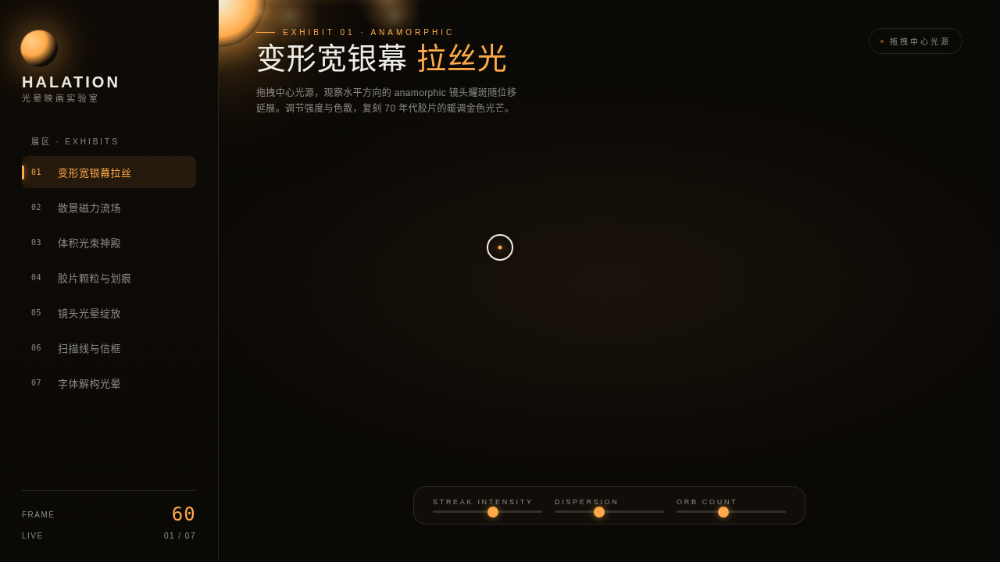

# HALATION 光晕映画实验室

- **日期**：2026-08-17
- **方向**：V3 UX 交互设计
- **主题**：电影光效组件特效实验室——以电影摄影中的光现象为展品的炫技组件特效装置，每个展区可亲手把玩。
- **配色**：墨黑 `#0B0906` 主底 + 钨丝橙 `#FFA949` + 琥珀金 `#FFD08A` + 银白 `#EDEDE6`（无蓝紫渐变）

## 简介
纯 vanilla 单文件实现的特效实验室，7 个展区各为独立组件级光效装置：变形宽银幕拉丝、散景磁力流场、体积光神殿、胶片颗粒与划痕、镜头光晕绽放、扫描线与信框、字体解构光晕。每个展区必须上手拖拽/滑动/点击才有意义。

## 截图

## 动效亮点
15 个组件级特效：自定义光标（白环+钨橙内点+发光，三态+涟漪）、anamorphic 耀斑延展、散景磁力流场（反平方引力+阻尼）、体积光束+尘埃、卡片 3D 倾斜弹簧、canvas 胶片颗粒实时生成、划痕闪烁、曝光条弹簧计数、bloom 绽放+卡片抬起、光泽扫过、CRT 扫描光束、RGB 色散 glitch、画幅信框升降、字体四模式解构、canvas 粒子轨迹。

## 在线预览
- 妙搭应用：https://dcniaqwtmoca.feishu.cn/page/ZGUqmgqPfdQgnHaYJ8LcPt9Rn6e

## 文件说明
| 文件 | 说明 |
|------|------|
| index.html | 完整可运行源码（纯 vanilla 单文件，CSS/JS 全内联） |
| 设计规范.md | 色彩系统、展区结构、动效系统、实现说明 |
| preview.png / thumbnail.png | 实验室界面截图 |

## 技术栈
纯 vanilla HTML/CSS/JS（无 React / 无 Babel / 无外部 CDN）、Canvas 2D、CSS3 动画、自定义光标系统、prefers-reduced-motion 降级。
