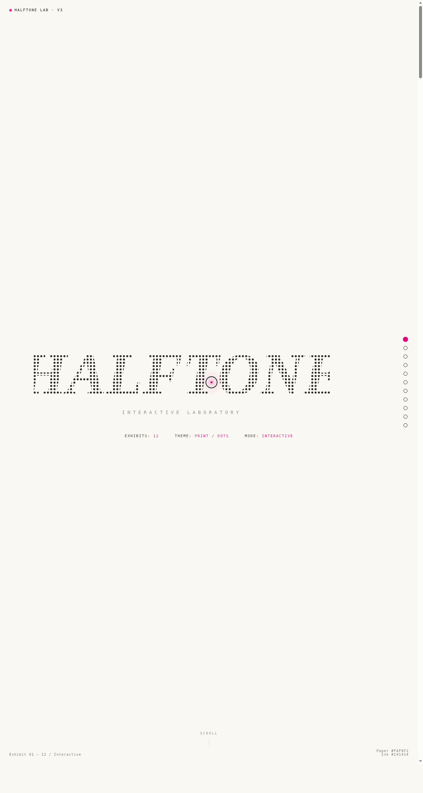

# HALFTONE 半调网点实验室

> 日期：2026-08-17 ｜ 方向：V3 UX 交互设计 ｜ 主题：印刷半调网点（Halftone）炫技特效实验室

## 简介

以印刷半调网点（Halftone）为母题的炫技组件特效实验室。9 个展区均为可亲手把玩的组件级特效装置：网点发生器、抖动算法集、CMYK 分色叠加、网点流场、磁力形变、印刷数据、网点诗篇、视差层叠、声音成像。配色取 CMYK 印刷气质（纸白 + 墨黑 + 品红 + 青）。

## 动效亮点

- 网点发生器：实时调线数/网角/网点大小 + 鼠标引力形变
- 抖动算法三对照（Floyd-Steinberg / Bayer / Atkinson）
- CMYK 四色分色叠加 + 乘法混色开关
- 噪声流场粒子 + 拖尾、反平方磁力形变 + 弹簧阻尼
- 64 根频谱柱声音成像（四色分区）
- 自定义光标：白粗环 + 品红内点 + 光晕 + 点击涟漪

## 妙搭在线预览

https://dcniaqwtmoca.feishu.cn/page/EegVmGXYidXEp0aR4cGcIPcbncd

## 文件说明

| 文件 | 说明 |
|------|------|
| index.html | 完整可运行源码（纯 vanilla 单文件，9 展区） |
| 设计规范.md | 色彩/字体/展区/动效规范 |
| preview.png | 页面截图 |

## 技术栈

纯原生 HTML/CSS/JS 单文件，无 React / 无 Babel / 无外部 CDN 依赖。
