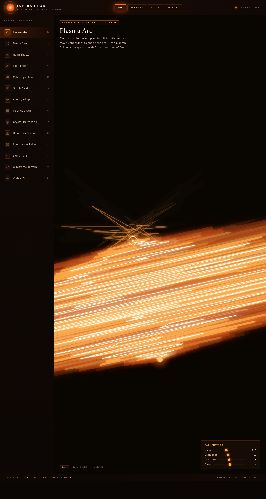

# INFERNO · 等离子电弧特效实验室

> 日期：2026-08-17 · 方向：V3 UX 交互设计 · 主题：等离子电弧熔火特效实验室

## 简介

INFERNO 是一个以"熔火等离子"为主题的炫技组件特效实验室，包含 14 个独立的、视觉冲击力强的组件级特效装置。每个展区都是一件可亲手操作的视觉装置——光标驱动电弧分叉、吸引萤火虫粒子、穿过文字使其爆炸解构、排斥液态金属熔滴……所有展区都需上手交互才有意义。

## 配色

熔铁黑（#0a0604）+ 等离子橙红（#ff2e2e）+ 熔岩橙（#ff6b1a）+ 熔金琥珀（#e9b661）+ 暖白（#fff3c8），暖色系完全避开蓝紫渐变。

## 动效亮点

- 14 个独立展区特效（电弧/粒子/文字解构/液态金属/频谱/故障/能量环/磁力网格/水晶折射/全息扫描/冲击波/光带拖尾/线框地形/涡旋视界）
- 自定义光标（白环 + 金内点 + 多层发光 + 悬停放大 + 点击涟漪）
- 每个展区 4 个参数滑块实时调节
- 顶部分类过滤 + 侧边栏展区切换
- 底部状态读数（FPS / 粒子数 / 坐标）

## 截图

## 妙搭在线预览

https://dcniaqwtmoca.feishu.cn/page/ZytWm9OtUd2bBsa1oJ3cxrEon6u

## 文件说明

| 文件 | 说明 |
|------|------|
| index.html | 完整单文件源码（纯 vanilla HTML + CSS + JS） |
| 设计规范.md | 色彩系统、字体、组件、动效规范 |
| preview.png | 页面截图 |
| README.md | 本说明文件 |

## 技术栈

纯 vanilla HTML/CSS/JS 单文件实现，无 React / 无 Babel / 无外部 CDN 依赖。Canvas 2D 渲染所有特效，RAF 动画循环 + visibilitychange 暂停 + prefers-reduced-motion 降级。
