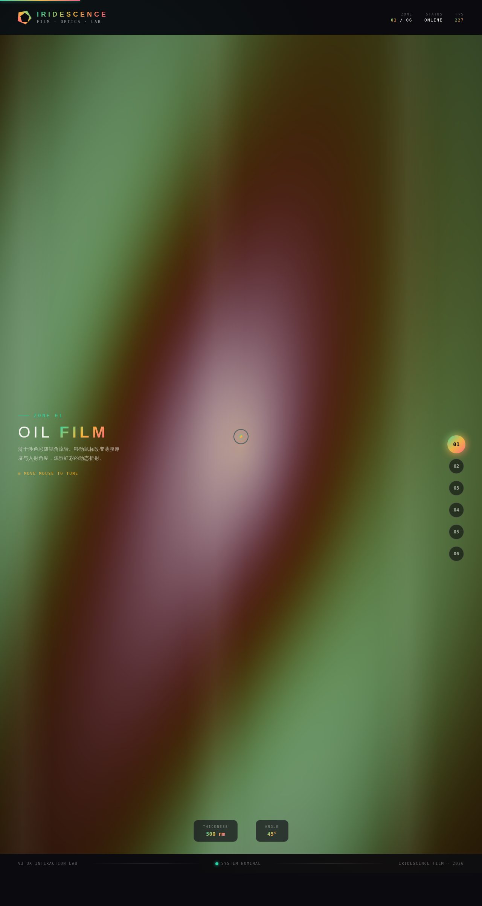

# IRIDESCENCE 虹彩薄膜实验室

> 日期：2026-08-17 · 方向：V3 UX 交互设计 · 主题：虹彩 / 薄膜干涉光学特效实验室

## 简介

一座可亲手把玩的虹彩 / 薄膜干涉光学特效实验室。6 个独立展区，每个是一个视觉冲击力强的组件级特效装置，必须上手操作（移动鼠标 / 拖拽 / 点击 / 调参）才有意义。纯视觉炫技的组件特效动画，非物理公式演示。

## 配色

深炭黑 `#0B0B0F` + 翡翠绿 `#2DD4A7` + 琥珀金 `#F5B840` + 玫红 `#FF5C8A` + 珍珠白 `#F5F5F0`。油膜虹彩用 teal-green / gold / rose 三色流转，明确不用蓝紫渐变。

## 展区

1. **Oil Film**——油膜虹彩 shader（鼠标控膜厚 / 视角）
2. **Particle Field**——反平方引力粒子散射场（左键排斥）
3. **Text Deconstruct**——文字逐字弹簧解构（靠近飞散 / 远离回归）
4. **Magnetic Core**——磁力按钮（距离反比吸附形变）
5. **Spectrum Visualizer**——32 柱频谱（4 种波形切换）
6. **Cursor Trail**——24 颗粒子弹性阻尼拖尾

## 动效亮点

- 自定义光标：白环 + 虹彩内点 + 多层发光，开页即现于屏幕中央，悬停三态切换，点击涟漪
- 12+ 组件级特效：油膜流转、粒子引力、文字解构、磁力形变、频谱振动、光标拖尾、滚动渐入、悬停发光、数字计数、光泽扫过、展区过渡、Logo 自旋、状态脉冲
- 动效基于 RAF 积分器 / 阻尼 / 弹簧 / 反平方引力，周期各不相同

## 截图

## 妙搭在线预览

https://dcniaqwtmoca.feishu.cn/page/P3JOmon4OdEtlvad0MJc3hcJnOc

## 文件说明

| 文件 | 说明 |
|---|---|
| index.html | 单文件完整源码（纯 vanilla HTML/CSS/JS，无 React / 无 Babel / 无外部 CDN） |
| preview.png | 1280×2400 页面截图 |
| 设计规范.md | 色彩 / 字体 / 展区 / 动效 / 健壮性规范 |
| README.md | 本说明文件 |

## 技术栈

纯 vanilla HTML / CSS / JavaScript 单文件实现，Canvas 2D 绘制，无 React / 无 Babel / 无外部 CDN 依赖。

## 操作提示

右侧 6 个圆点切换展区，也可用方向键切换。每个展区都需上手操作（移鼠标 / 点击 / 拖拽 / 按住）才能看到完整效果。
