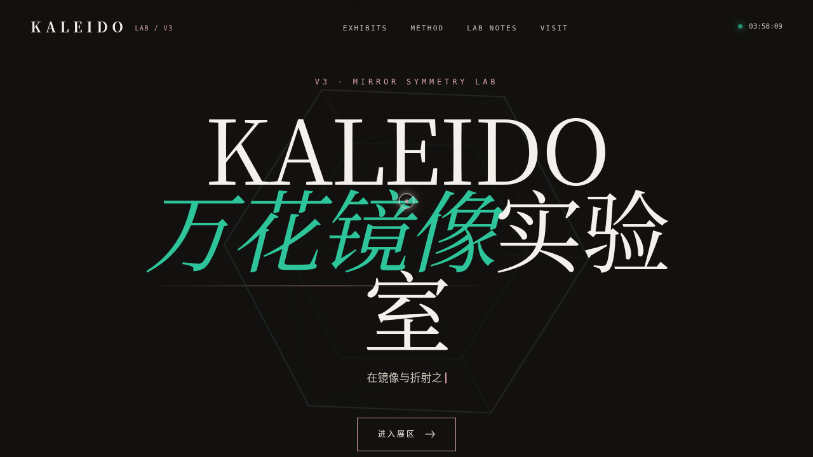

# KALEIDO 万花镜像实验室

> 日期：2026-08-17 · 方向：V3 UX 交互设计 · 主题：镜像对称 / 万花筒光学炫技特效

## 简介

一座可亲手把玩的镜像光学特效实验室，六座互动装置：N 重镜像万花筒、对称曼陀罗画笔、碎镜折射场、光圈棱镜旋转、镜像频谱环、多边形镜像扭曲，每个装置必须上手操作才有意义。宝石切面气质（祖母绿 + 玫瑰金 + 墨黑 + 珍珠白）。

## 截图

## 动效亮点

自定义光标（弹簧跟随/三态/涟漪）、粒子镜像复制、实时对称绘图、碎镜递增、六边形光圈反向旋转、频谱对称环、3D 卡片倾斜、滚动渐入、打字机、数字计数、宝石切面装饰、中心脉冲核。

## 妙搭在线预览

https://dcniaqwtmoca.feishu.cn/page/UuEGmxL4ddQVisa8G3IccS2tn3c

## 文件说明

| 文件 | 说明 |
|------|------|
| index.html | 完整可运行源码（纯 vanilla 单文件，无 React/Babel/CDN 依赖） |
| 设计规范.md | 色彩/字体/装置/动效 |
| preview.png | 页面截图 |
| thumbnail.png | 平台缩略图 |
| README.md | 本说明 |

## 技术栈

纯 vanilla HTML/CSS/JS 单文件；统一 RAF 调度器；支持 prefers-reduced-motion 与 visibilitychange 暂停。
