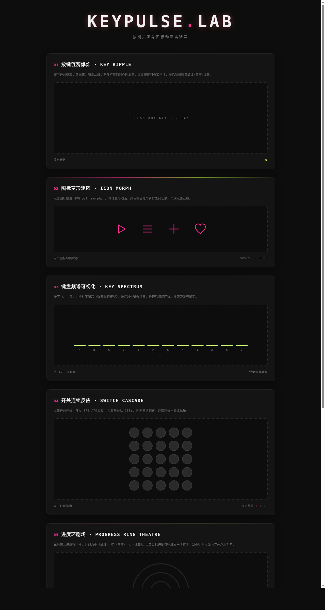

# KEYPULSE — 按键脉冲实验室

> 日期：2026-08-17 · 方向：V3 UX 交互设计 · 主题：按键交互与可视化图标动画实验室

## 简介

「KEYPULSE 按键脉冲实验室」是一个以按键交互与可视化图标动画为展品的可亲手把玩实验室。6 个独立展区，每个都是上手操作才有意义的组件级交互装置：按键涟漪爆炸、图标变形矩阵、键盘频谱可视化、开关连锁反应、进度环剧场、文字粒子解构。纯 vanilla 单文件实现，零外部依赖。

## 截图

## 动效亮点

- 按键涟漪爆炸：Canvas 同心圆阻尼衰减 + 随机三色 + 干涉效果
- 图标变形矩阵：4 组 SVG path morphing + spring easing
- 键盘频谱：12 根柱条 spring 物理弹起（stiffness + damping）
- 开关连锁反应：5×5 网格 BFS 扩散 + 100ms 层级延迟
- 文字粒子解构："KEYPULSE" 像素采样炸开 + 重力回收重组

## 配色

虚空黑 `#0d0d0d` + 电子品红 `#ff2d92` + 酸性青柠 `#c4ff3e` + 冰白 `#f0f0f0` + 中灰 `#6b6b6b`

## 文件说明

| 文件 | 说明 |
|------|------|
| `index.html` | 完整可运行源码（vanilla HTML+CSS+JS 单文件） |
| `preview.png` | 页面截图（1280×2400） |
| `设计规范.md` | 设计规范文档 |

## 妙搭在线预览

https://dcniaqwtmoca.feishu.cn/page/CMgomqfXHd4VCAa8adscag97nxe

## 技术栈

HTML5 + CSS3 + Vanilla JS + Canvas API + SVG，纯单文件无框架依赖
