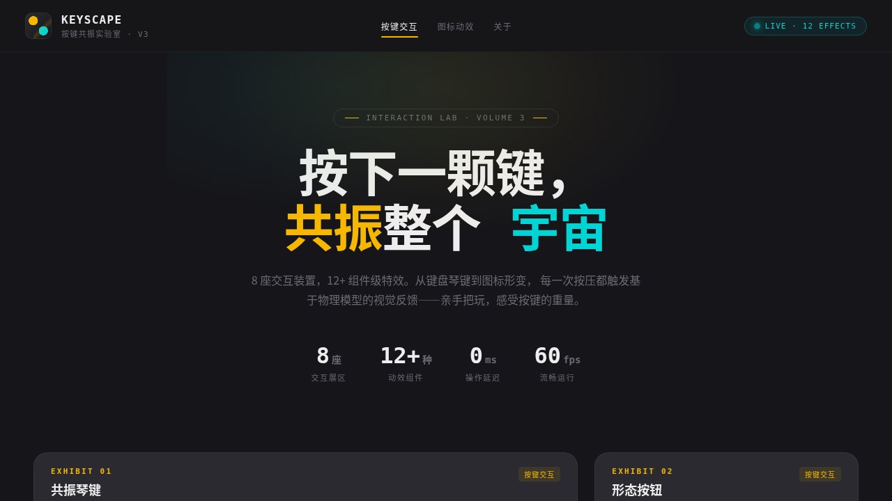

# KEYSCAPE 按键共振实验室

> 日期：2026-08-17 · 方向：V3 UX 交互设计 · 主题：按键交互与可视化图标动画实验室

## 简介

一个可亲手把玩的按键 / 按钮 / 开关交互与可视化图标动画实验室。8 座独立展区，每座上手操作（按键 / 点击）才有意义：共振琴键、形态按钮、连锁开关、组合键反应堆、图标形变、轨道进度环、路径编织器、脉冲矩阵。

## 配色

炭黑 `#16161A` · 琥珀黄 `#F5B700` · 电青 `#00D4D4` · 银白 `#EDEDED` · 石墨 `#2A2A30`

## 动效亮点

- 共振琴键：按下深度映射振幅，音色柱阻尼共振
- 组合键反应堆：能量累积 + Shift 叠加 + Ctrl+Space 大招，弹簧缓动三环
- SVG 图标 5 形态路径插值变形
- 脉冲矩阵 8×6 点阵环状扩散，琥珀/电青双色交替
- 路径编织器三条波形逐笔描边绘制

## 文件说明

| 文件 | 说明 |
|------|------|
| index.html | 完整源码（纯 vanilla HTML/CSS/JS 单文件） |
| 设计规范.md | 色彩/字体/展区/动效规范 |
| thumbnail.png | 页面截图 |

## 妙搭在线预览

https://dcniaqwtmoca.feishu.cn/page/BIL6mwrUBdAvrya3FhQcnCBXnSe

## 技术栈

纯 vanilla HTML/CSS/JS，Canvas 2D，SVG 路径动画，requestAnimationFrame。零 React / 零 Babel / 零外部 CDN 依赖。
