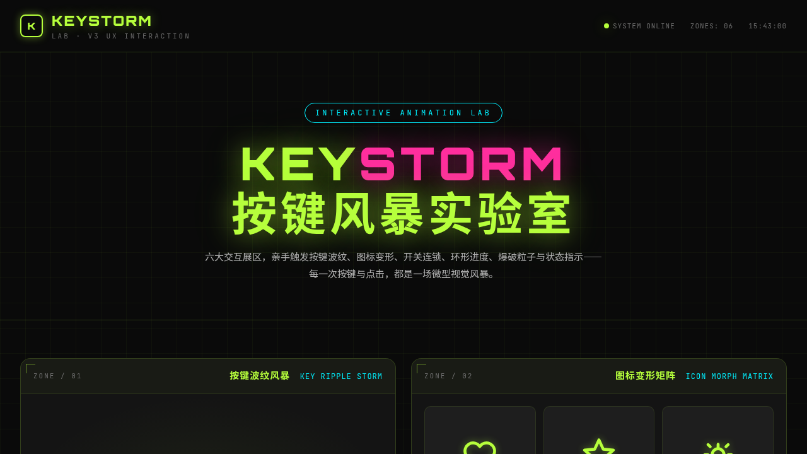

# KEYSTORM 按键风暴实验室

> 日期：2026-08-17 · 方向：V3 UX 交互设计 · 主题：按键交互与可视化图标动画实验室

## 简介

KEYSTORM 是一个以「按键交互与可视化图标动画」为展品的可亲手把玩实验室。6 个展区各为独立交互装置：按键波纹风暴（键盘触发涟漪+粒子飞溅）、图标变形矩阵（SVG morphing）、开关交响曲（5 种风格开关）、进度环星系（环形进度动画）、点击爆破粒子工厂（物理散落粒子）、状态指示器花园（4 状态切换）。深炭黑 + 荧光酸橙 + 霓虹品红 + 电光青的荧光科技感配色。

## 截图

## 动效亮点

按键涟漪三重扩散 + 18 粒子飞溅 + 键名字母弹出消散、SVG 路径 morphing 变形、5 种风格开关连锁动画（滑动弹性/3D 翻转/脉冲波纹/弹跳重力/磁吸卡位）、环形进度错峰填充 + 数字计数、爆炸粒子物理散落（重力+弹跳+碰撞）、状态指示器 4 态切换（呼吸灯/脉冲圈/加载点/波形条/旋转环）（14+ 动效）。

## 妙搭在线预览

https://dcniaqwtmoca.feishu.cn/page/EnNvmgePtdtXmoals25cVDO7nyb

## 文件说明

| 文件 | 说明 |
|------|------|
| index.html | 完整可运行源代码（纯 vanilla HTML/CSS/JS 单文件） |
| 设计规范.md | 色彩系统、字体、组件、动效、展区结构设计规范 |
| preview.png | 页面截图 |
| thumbnail.png | 平台自动生成缩略图 |

## 技术栈

纯 vanilla HTML/CSS/JS（无 React / 无 Babel / 无外部 CDN 依赖） · Canvas 2D API · SVG path morphing · CSS Animation · requestAnimationFrame · 支持 prefers-reduced-motion · visibilitychange 自动暂停
