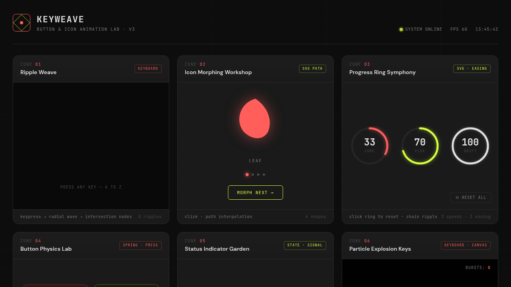

# KEYWEAVE 按键织机实验室 · UX 交互设计

> 日期：2026-08-17 · 方向：V3 UX 交互设计 · 主题：按键交互与可视化图标动画

## 简介

一个以「按键交互与可视化图标动画」为展品的可亲手把玩实验室，6 个展区各是一个独立的、视觉冲击力强的组件级交互装置。深炭黑+电珊瑚+嫩黄绿+银白配色，合成器波风格深色实验室美学。纯 vanilla 单文件实现，无 React/Babel/CDN 依赖。

## 妙搭在线预览

https://dcniaqwtmoca.feishu.cn/page/RzoQmGDmvddkZKa0mPhcAswunuX

## 截图

## 6 大展区

| # | 展区 | 触发方式 | 核心动效 |
|---|------|---------|---------|
| 01 | 按键波纹织网 | 键盘 A-Z | Canvas 径向波纹扩散+交叉光点连线织网 |
| 02 | 图标变形工坊 | 点击按钮 | SVG path morphing（叶→水滴→火焰→雪花） |
| 03 | 进度环交响曲 | 点击环/重置 | 3 条环形进度，不同速度+缓动函数，连锁波纹 |
| 04 | 按钮物理反馈 | 按下按钮 | 弹簧物理模型积分器，4 组弹性系数+振荡标尺 |
| 05 | 状态指示器花园 | 点击切换 | 6 种指示器×3 种状态（呼吸/脉冲/扫描/信号/电池/加载） |
| 06 | 爆炸粒子击键器 | 点击画布/数字键 1-6 | 6 种粒子形态，重力+摩擦衰减+地面反弹 |

## 动效亮点

- 按键波纹交叉织网（Canvas 实时碰撞检测）
- SVG path 平滑 morphing 变形
- 弹簧物理 RAF 积分器（位移/速度/加速度）
- 粒子爆炸物理系统（重力/摩擦/反弹/能量衰减）
- 12+ 组件级特效，统一 RAF 管理器
- 支持 prefers-reduced-motion 降级

## 文件说明

| 文件 | 说明 |
|------|------|
| index.html | 完整可运行的源代码（纯 vanilla HTML/CSS/JS 单文件） |
| 设计规范.md | 色彩系统、字体、展区规范、动效系统、健壮性说明 |
| preview.png | 页面截图预览 |
| thumbnail.png | 缩略图 |

## 技术栈

纯 vanilla HTML/CSS/JS 单文件，Canvas 2D + SVG + CSS Animations。无 React/Babel/CDN 依赖。统一 RAF 管理器，visibilitychange 自动暂停/恢复。
