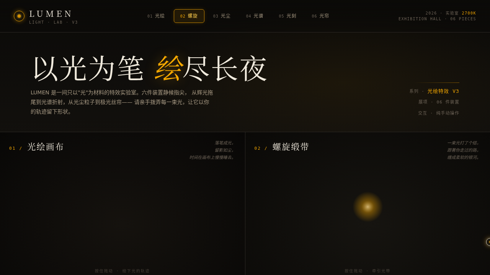

# LUMEN 光绘实验室

- **日期**：2026-08-17
- **方向**：V3 UX 交互设计（炫技组件特效动画实验室）
- **主题**：以"光"为唯一材料的特效实验室——长曝光摄影与钨丝灯暖金的美学源头

黑暗房间里的暖光。炭黑底 + 钨金 + 月白 + 朱红点缀，六件可以用手"拨弄光"的装置，每件都配独立控制参数与一句诗意展品说明。纯 vanilla 单文件实现，零外部依赖。

## 六件装置

1. **光绘画布** — 按住拖动留下 additive 辉光拖尾，可调色相/衰减/笔刷，可保存 PNG
2. **螺旋缎带** — 鼠标牵引多层螺旋光带，弹簧 + 阻尼惯性追随，松手自旋衰减
3. **光尘粒子场** — 200+ 辉光尘埃，鼠标排斥/吸引力场 + Bloom 叠层
4. **光谱折射** — 拖动白光穿过棱镜，色散成七色扇形光谱，角度实时可拨
5. **频闪光刻** — 扫描光带逐行显影文字，拖拽控制扫描速度与方向
6. **极光丝帘** — 多层正弦光帘随鼠标起伏，点击激起涟漪波

## 动效亮点

- 自定义光标：白色粗环 + 钨金内点 + 发光层，开页即居中，悬停放大变色、点击涟漪
- 统一 RAF 调度器，动效周期各异；弹性/惯性/衰减连续积分模型
- 每展区独立滑杆/按钮/开关控制，上手操作才有意义

## 文件说明

| 文件 | 说明 |
|---|---|
| `index.html` | 完整单文件实验室（纯 vanilla HTML/CSS/JS，零外部依赖） |
| `设计规范.md` | 色彩系统 / 字体 / 装置说明 / 动效系统 |
| `thumbnail.png` | 页面截图 |
| `README.md` | 本文件 |

## 在线预览

https://dcniaqwtmoca.feishu.cn/page/Ralvm0z38dum4JaqLeycAh8bnPd

## 技术栈

纯 vanilla HTML/CSS/JS 单文件（无 React / 无 Babel / 无 CDN），Canvas 2D additive 混合 + Bloom 叠层 + 统一 RAF 调度，visibilitychange 自动暂停、prefers-reduced-motion 降级。
