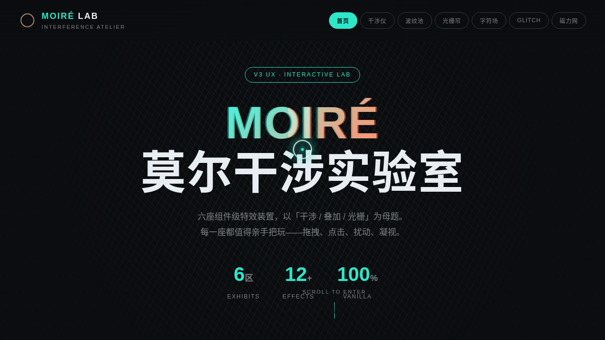

# MOIRÉ 莫尔干涉实验室

- **日期**：2026-08-17
- **方向**：V3 UX 交互设计
- **主题**：以「干涉 / 叠加 / 光栅」为统一视觉母题的炫技组件特效实验室，6 个可亲手把玩的组件级特效装置。
- **配色**：石墨黑 `#0B0D10` + 荧光青 `#2EE6C8` + 暖珊瑚 `#FF7051` + 银白 `#E8EDF2`

## 简介
纯 vanilla 单文件实现，无 React / 无 Babel / 无 CDN 依赖。6 个展区：莫尔干涉仪、波纹干涉池、光栅拖影帘、字符干涉场、扫描线 GLITCH 滤镜、磁力网格。每个展区上手操作才有意义，全部基于物理模型（RAF 积分器 / 弹簧 / 阻尼 / 反平方引力 / 波方程 / 噪波场）。

## 截图

## 动效亮点
自定义光标（白环+荧光青内点+多层发光+三态+点击涟漪，开页即居中）、hero 双光栅旋转干涉背景、数字计数、logo 脉冲、光泽扫过按钮、滚动渐入、打字机、悬停发光、扫描线动效、波纹传播、弹簧回弹、磁力形变，共 12+ 组件级特效。

## 在线预览
- 妙搭应用：https://dcniaqwtmoca.feishu.cn/page/KHXmm6VIldQKfFaeh0UcMxTqnEd

## 文件说明
| 文件 | 说明 |
|------|------|
| index.html | 完整可运行源码（纯 vanilla 单文件，零外部依赖） |
| 设计规范.md | 色彩系统、字体、6 展区定义、动效、健壮性 |
| thumbnail.png | 实验室界面截图 |

## 技术栈
原生 HTML / CSS / JavaScript、Canvas 2D、Perlin 噪波、波方程数值积分、requestAnimationFrame 积分器、prefers-reduced-motion 降级。
