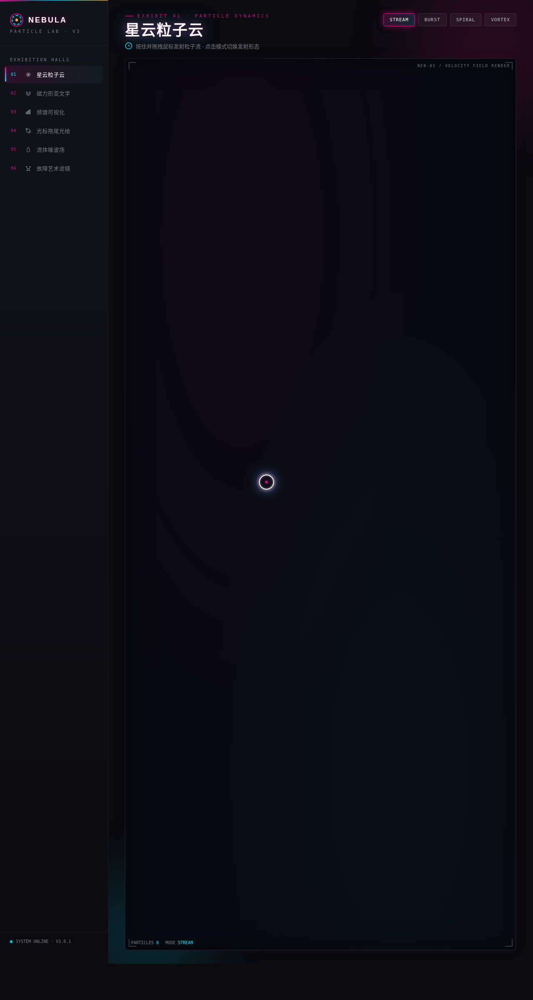

# NEBULA 星云粒子实验室 · 炫技组件特效陈列馆

> 方向：V3 UX 交互设计 · 日期：2026-08-17 · 主题：星云粒子特效实验室

## 简介

NEBULA 是一个由粒子、光、色彩构成的星云特效陈列馆。6 个独立展区各为一个可亲手把玩的组件级特效装置——拖拽粒子流、磁力形变文字、频谱可视化、光标拖尾光绘、流体噪波场、故障艺术滤镜。每个展区必须上手操作才有意义。

## 截图

## 配色

虚空黑 `#0A0A0F` + 品红 `#C71585` + 电青 `#00E5FF` + 熔金 `#FFB347`，双色霓虹对撞，禁止蓝紫渐变。

## 动效亮点

- 星云粒子云：按住拖拽发射粒子流，4 种发射模式（流/爆/螺旋/涡旋），粒子沿速度场流动发光拖尾
- 磁力形变文字：粒子构成的标题文字，鼠标靠近被磁力排斥/吸引产生形变，离开回弹
- 流体噪波场：鼠标搅动流体产生漩涡与色彩混合，3 种色彩方案
- 故障艺术滤镜：鼠标划过产生 RGB 分离 + 扫描线 + 像素错位，可调故障强度
- 自定义光标：白环 + 品红内点 + 多层发光，悬停三态切换

## 在线预览

https://dcniaqwtmoca.feishu.cn/page/ZK1dmaO91dhLeXajiuZcGOtpnAh

## 文件说明

| 文件 | 说明 |
|------|------|
| index.html | 完整可运行源码（纯 vanilla 单文件） |
| preview.png | 页面截图 |
| 设计规范.md | 色彩/字体/展区/动效规范 |

## 技术栈

纯 HTML/CSS/JavaScript，无 React/Babel/CDN 依赖。
