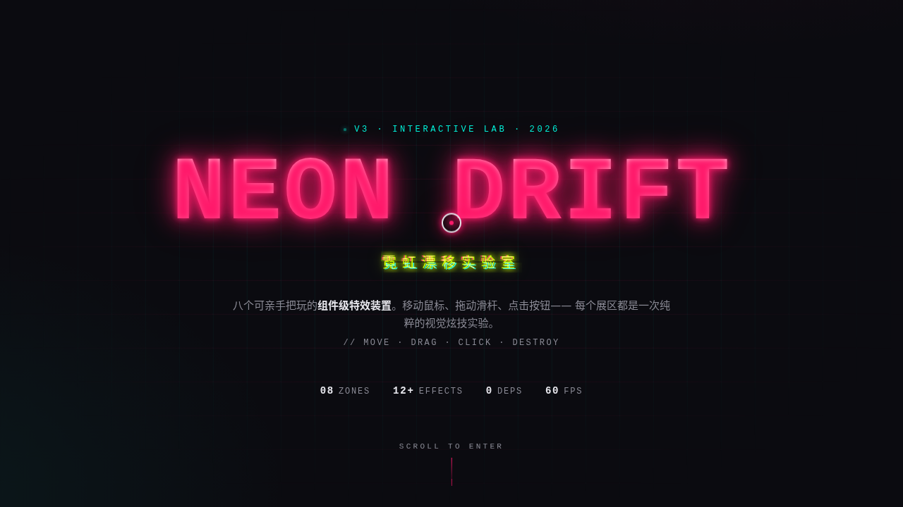

# NEON DRIFT 霓虹漂移实验室 · 炫技组件特效动画

- **日期**：2026-08-17
- **方向**：V3 UX 交互设计
- **主题**：霓虹故障美学的炫技组件特效实验室

## 简介

「NEON DRIFT」是以炫技组件特效动画为展品的可亲手把玩实验室。8 个独立展区，每个是一个视觉冲击力强的组件级特效装置，必须上手操作才有意义：粒子引力场、RGB 分裂故障、扫描线滤镜、文字解构、光标拖尾、噪波流场、频谱可视化、磁力形变按钮。每个展区配可调参数（滑杆/按钮）。

## 设计说明

- **配色**：霓虹粉 `#FF1A6B` + 酸橙绿 `#C6FF00` + 电光青 `#00F0D8` + 炭黑 `#0A0A0F` + 银白 `#E8E8EE`，高对比霓虹夜感，严禁蓝紫渐变。
- **字体**：Orbitron（展示）/ Inter（正文）/ 等宽 mono（参数数值）。
- **布局**：单页纵向展区流，每个展区独立卡片 + 可调参数面板。

## 动效亮点

12+ 组件级特效：自定义光标（白环+霓虹粉点+发光+涟漪）、粒子引力、RGB glitch、扫描线+光束、文字碎裂重组、霓虹拖尾、Perlin 噪声流场、频谱柱、磁力形变、滚动渐入、光泽扫过、数字计数、入场序列、打字机光标、脉冲点。动效遵循物理（反平方引力 / Perlin 噪声 / 磁力吸附），严禁整图缩放 / Ken Burns。

## 截图

## 妙搭在线预览

https://dcniaqwtmoca.feishu.cn/page/TpJ9mI7qudeOLpabFMzcqVUVnIg

## 文件说明

| 文件 | 说明 |
|------|------|
| index.html | 完整可运行源码（纯 vanilla 单文件） |
| 设计规范.md | 色彩 / 字体 / 组件 / 动效 / 展区结构 |
| thumbnail.png | 页面截图 |
| README.md | 本说明 |

## 技术栈

纯 vanilla HTML/CSS/JS 单文件，无 React / Babel / 外部 CDN 依赖，所有代码内联。
