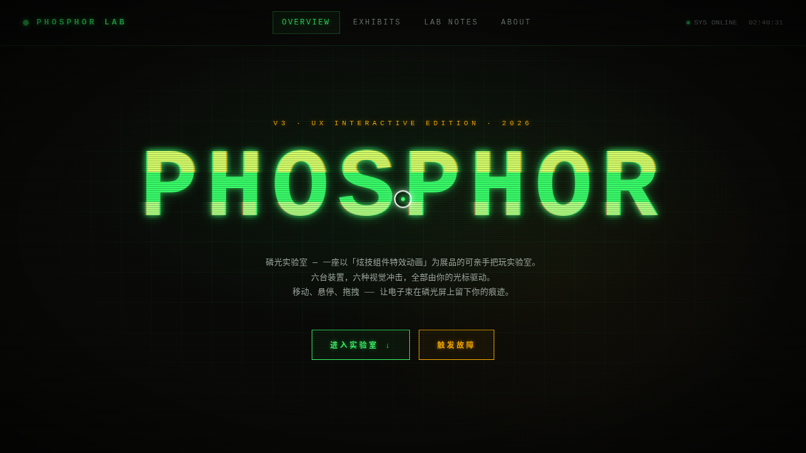

# PHOSPHOR 磷光实验室

- **日期**：2026-08-17
- **方向**：V3 UX 交互设计（炫技组件特效动画实验室）
- **主题**：复古 CRT 磷光屏美学 × 故障艺术（glitch）
- **配色**：磷光绿 `#39FF6A` + 琥珀橙 `#FFB000` + 深炭黑 `#0A0A08` + 银灰 `#B8C4BC`

## 简介

一座以「磷光」为核心的组件特效实验室：6 个独立展区全部是必须亲手操作的特效装置——磷光拖尾（指数衰减余晖）、CRT 扫描线滤镜（参数可调）、半调网点形变、ASCII 字符流场、RGB 色差故障字、可拖拽融合的磁流体 Metaballs。全局叠加 CRT 扫描线与暗角，暗室荧光氛围贯穿始终。纯 vanilla 单文件实现，零外部依赖。

## 动效亮点

- 磷光指数衰减残影（可调半衰期 / 粗细 / 双色模式）
- 实时 CRT 滤镜：扫描线 + 滚动电子束 + 噪声 + 暗角 + 随机闪烁
- 鼠标驱动的半调网点形变与 ASCII 流场扰动
- RGB 通道分离 + 切片 glitch，越靠近越剧烈
- SVG goo filter 磁流体 Metaballs：拖拽融合、点击生成、双击删除
- 自定义光标：白环 + 磷光内点 + 多层发光，开页居中，悬停变色，点击涟漪

## 妙搭在线预览

https://dcniaqwtmoca.feishu.cn/page/GLZ2maYyDdn0iKatmz2cGirCn1A

## 文件说明

| 文件 | 说明 |
|------|------|
| `index.html` | 完整单文件源码（纯 vanilla，内联 CSS/JS），可直接在浏览器打开预览 |
| `设计规范.md` | 色彩 / 字体 / 展区结构 / 动效系统 / 健壮性规范 |
| `preview.png` / `thumbnail.png` | 页面截图 |
| `README.md` | 本文件 |

## 技术栈

纯原生 HTML / CSS / JavaScript 单文件，Canvas 2D + SVG filter，零外部依赖。
