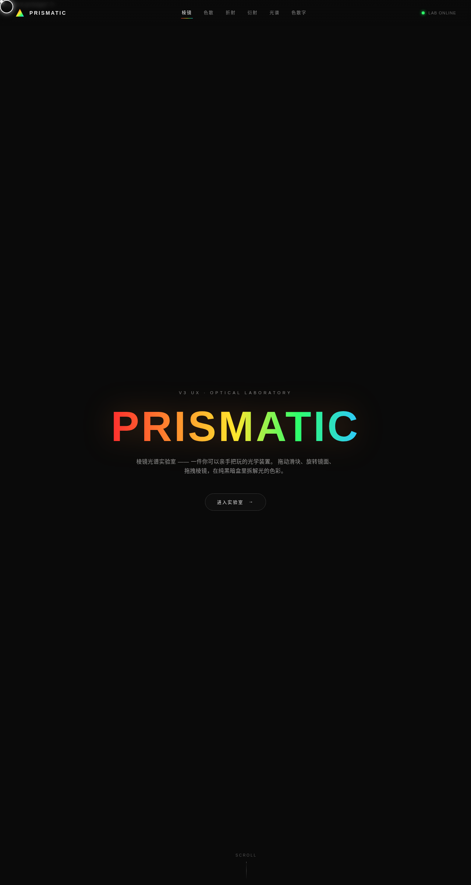

# PRISMATIC 棱镜光谱实验室 · 光学特效装置

> 日期：2026-08-17 · 方向：V3 UX 交互设计 · 主题：棱镜光谱/光线折射色散特效
> 配色：纯黑 #0A0A0A 底 + 光谱色（红 #FF2E2E / 橙 #FF8C2E / 黄 #FFE62E / 绿 #2EFF6B / 青 #2EC8FF）+ 银白 #E8E8E8（无蓝紫渐变）

## 简介

「PRISMATIC 棱镜光谱实验室」是一件以「炫技组件特效动画」为展品的可亲手把玩实验室。每个展区是一个独立的、视觉冲击力强的组件级光学特效装置，必须上手操作（拖动/点击/滑动）才有意义。整体黑匣子光学实验室质感，纯黑底 + 光谱色散光效。

## 截图

## 展区与动效亮点

- 棱镜色散（旗舰）：拖动棱镜/调入射角，白光实时分解成连续光谱（斯涅尔折射定律）
- 光线追踪迷宫：点击镜面旋转，光路实时重算多次反射
- 光栅衍射：调狭缝密度+波长，干涉条纹实时变化
- 光谱粒子流场（旗舰）：鼠标吸引粒子、点击爆炸，Perlin 噪波流场+拖尾
- 霓虹光谱灯 Bloom / 磁力形变场 / 色散文字（RGB 三通道色差）
- 自定义光标（白环+内点+多层发光，弹簧物理，开页即居中，z-index 最高）

## 文件说明

| 文件 | 说明 |
|------|------|
| index.html | 完整可运行源码（纯 vanilla HTML/CSS/JS 单文件，无外部依赖） |
| 设计规范.md | 色彩系统、字体、展区、动效、健壮性 |
| preview.png | 实验室截图 |

## 妙搭在线预览

https://dcniaqwtmoca.feishu.cn/page/Tqfpmh5Xnd6FUDaJIZVcF5Zfn9b

## 技术栈

纯 HTML / CSS / JavaScript 单文件实现，零 React / Babel / 外部 CDN 依赖。Canvas 2D + 真实光学计算（斯涅尔定律/光栅方程/镜面反射）+ RAF 物理积分器。
