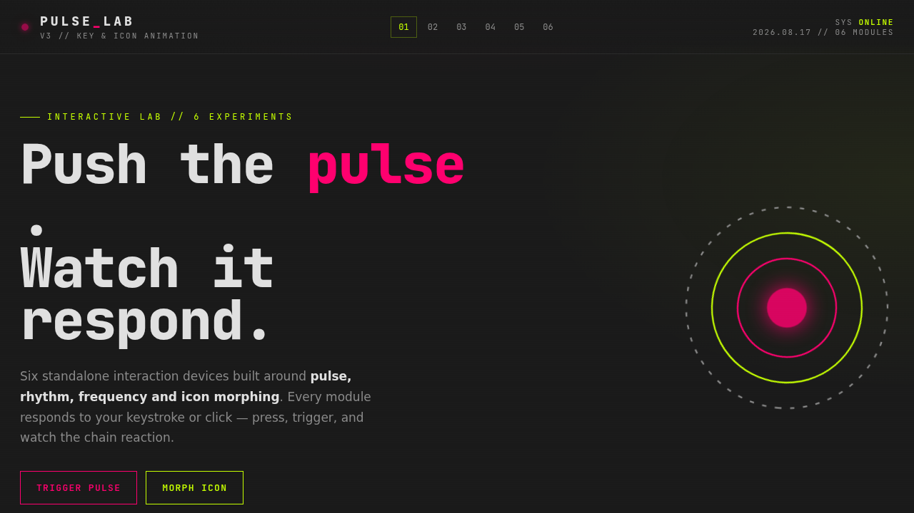

# PULSE 脉冲实验室 · UX 交互设计

> 日期：2026-08-17 · 方向：V3 UX 交互设计 · 主题：按键交互与可视化图标动画

## 简介

一个以「脉冲与节拍」为核心的交互装置实验室，6 个展区每个都是独立的、可亲手把玩的组件级交互装置。电光品红与酸橙绿的高对比配色，炭黑底色上呈现强烈的视觉冲击。按键盘触发波纹粒子、点击按钮让 SVG 图标变形、编排节拍矩阵、操控三环进度交响、切换状态指示器动画、释放物理粒子爆发——每个展区都需要上手操作才有意义。

## 截图

## 动效亮点

- **脉冲键盘**：真实键盘/点击触发 Canvas 波纹扩散 + 粒子爆炸，颜色轮换
- **图标 morphing**：SVG 路径点插值变形，齿轮→心脏→闪电→星星→花朵→六边形
- **节拍矩阵**：6×8 网格序列器，可播放/调速/随机/清空
- **进度环交响**：三同心环异速旋转，可加速/减速/反转
- **状态指示器花园**：6 种状态图标动画（Loading/Breathing/Pulsing/Scanning/Heartbeat/Radar）
- **粒子爆发器**：物理粒子（重力+弹跳+反弹+消散），三种触发模式

## 文件说明

| 文件 | 说明 |
|------|------|
| `index.html` | 完整实验室源码（含 HTML/CSS/JS） |
| `preview.png` | 页面截图 |
| `设计规范.md` | 设计规范文档（色彩/字体/展区/动效） |

## 妙搭在线预览

https://dcniaqwtmoca.feishu.cn/page/JyO6mLVJBdKtWVaminFchxu2nfi

## 技术栈

纯 vanilla HTML/CSS/JS 单文件实现，无 React / 无 Babel / 无外部 CDN 依赖。支持 prefers-reduced-motion、visibilitychange 自动暂停动画。
