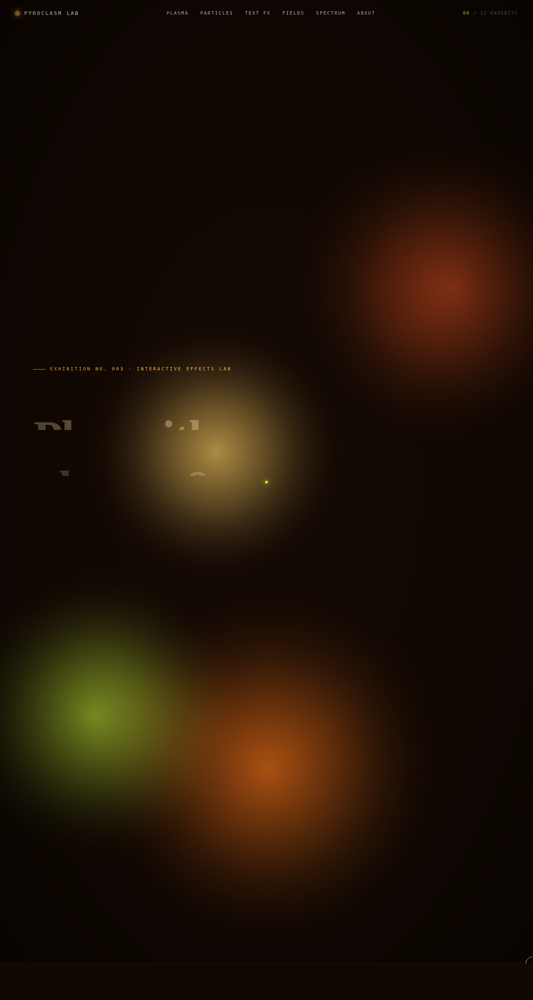

# PYROCLASM LAB · 焰爆等离子体实验室 · V3 UX 交互设计

## 基本信息

- **日期**：2026-08-17
- **方向**：V3 UX 交互设计
- **主题**：火焰与等离子体特效实验室
- **配色**：焦黑底 + 熔融琥珀 / 铜红 / 电石灰酸橙 / 暖金（暖色系光谱，无蓝紫渐变）

## 简介

以 12 个可亲手把玩的组件级视觉特效装置为展品的火焰实验室。每个展区是一个独立的视觉冲击力强的特效装置——等离子球形变、粒子火山灰、磁力文字解构、Perlin 噪波流场、频谱分析、磁力铁粉、多层视差烟尘、CRT 扫描线、弹簧计数器、冲击波干涉、3D 倾斜卡、等离子拖尾。

## 截图

## 动效亮点

- 12 个独立可交互展区，每个都有独特的物理/视觉模型
- 等离子球：可拖拽形变 + 点击过载爆发
- 粒子火山灰：上千粒子喷泉 + 点击爆炸
- 磁力文字解构：剪切力驱动字符飞散 + 点击切换单词
- Perlin 噪波流场：拖动留痕 + 自愈修复
- CRT 扫描线：雷达扫描 + 信号干扰 + 余晖
- 冲击波干涉：多道同心圆叠加干涉图案
- 自定义光标：白环 + 彩色内点 + 多层发光 + 悬停变形 + 点击涟漪

## 文件说明

| 文件 | 说明 |
|------|------|
| `index.html` | 完整源码（纯 vanilla HTML/CSS/JS 单文件） |
| `preview.png` | 页面截图（1280×2400） |
| `thumbnail.png` | 缩略图（1280×720） |
| `设计规范.md` | 设计规范文档 |

## 在线预览

[妙搭在线预览](https://dcniaqwtmoca.feishu.cn/page/ICdBm5ucid0q2CaQszyc4azhnwc)

## 技术栈

纯 vanilla HTML/CSS/JS 单文件实现，零 React/Babel/CDN 依赖。中央 RAF 注册中心 + IntersectionObserver 按需启动/注销。
