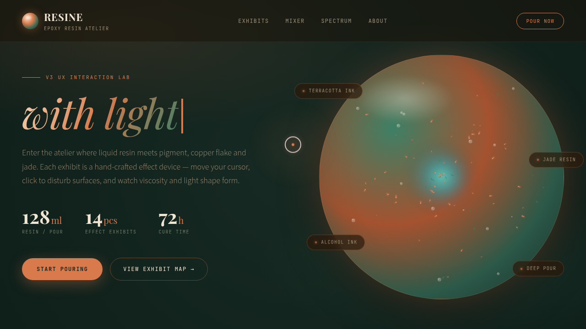

# RESINE · 翡翠陶土树脂实验室

> 日期：2026-08-17 ｜ 方向：V3 UX 交互设计 ｜ 主题：环氧树脂浇筑工作室 · 炫技组件特效实验室

## 简介

一座可亲手把玩的树脂浇筑特效实验室：主画布金箔粒子轨道与颜料涡流随手扰动，调色混合器三条滑块实时改变大画布，点击滴墨看卷须分形扩散，层叠扫描看树脂横截面，64 柱固化频谱随悬停起伏。深海墨绿 + 翡翠绿 + 陶土橙 + 奶油米白深色配色，纯 vanilla 单文件、零外部依赖。

## 截图

## 动效亮点

16 项组件级特效装置：树脂浇筑主画布（粒子轨道+涡流+气泡+磁力扰动）、自定义光标（悬停变色+点击涟漪）、打字机标题、数字计数、卡片 3D 倾斜（Hooke 弹簧阻尼）、光泽扫过、气泡上升（光标排斥）、金箔漂移（椭圆轨道+自转）、表面涟漪、颜料扩散（lighter 混合+分形卷须）、伪 Perlin 噪波流场、层叠扫描线、可拖拽调色混合器、固化频谱柱、跑马灯、滚动渐入+视差。

## 文件说明

| 文件 | 说明 |
|---|---|
| `index.html` | 完整单文件源码（HTML+CSS+JS 内联），浏览器直接打开可预览 |
| `设计规范.md` | 色彩系统（含色值）、字体、圆角、16 项特效清单、页面结构 |
| `preview.png` / `thumbnail.png` | 页面截图 |

## 在线预览

https://dcniaqwtmoca.feishu.cn/page/LOp4mUTR7d6NdoaXLhEcKmsmnod

## 技术栈

纯 vanilla HTML/CSS/JS 单文件（无 React / 无 Babel / 无外部 CDN 依赖）。
