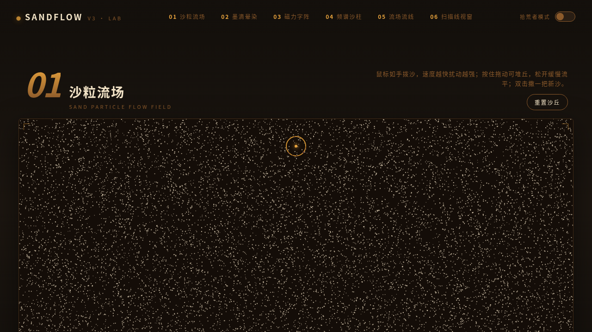

# SANDFLOW 沙画流体实验室（V3 UX 交互设计）

- 日期：2026-08-17
- 方向：UX 交互设计 · 炫技组件特效实验室
- 主题：暗夜沙丘 —— 沙、墨、磁力、频谱、流线与 CRT 辉光

## 简介

「SANDFLOW 沙画流体实验室」是一座可以亲手把玩的组件级特效装置馆：6 个独立展区，每个都必须上手操作才有意义——用手拨动上万颗沙粒、在纸面落墨晕染、拨开磁力字阵、激励频谱沙柱、搅动流场漩涡、在 CRT 扫描线里旋转 3D 沙漏。导航栏藏着「拾荒者模式」彩蛋，一键给全部展区叠加沙暴颗粒滤镜。

## 特效亮点

- 沙粒流场：鼠标速度场 + 摩擦衰减 + 高度场堆沙/流平/撒沙
- 墨滴晕染：Perlin 噪声径向晕染 + 纸纤维扩散 + 多墨融合
- 磁力字阵：反平方排斥 + 弹簧阻尼回位
- 频谱沙柱：伪频谱起伏 + 波浪传播
- 手写 3D 投影沙漏 + CRT 扫描线/辉光/色差滤镜
- 全局霓虹拖尾缎带 + 开页即居中的高对比自定义光标

## 文件说明

| 文件 | 说明 |
|------|------|
| `index.html` | 完整源码（纯 vanilla 单文件，浏览器直接打开即可把玩） |
| `preview.png` / `thumbnail.png` | 页面截图 |
| `设计规范.md` | 色彩 / 展品 / 全局组件 / 健壮性规范 |

## 在线预览

https://dcniaqwtmoca.feishu.cn/page/Mdsvmxt6EdzVeKaY56RcYPtSn7d

## 技术栈

纯 vanilla HTML/CSS/JS 单文件，零外部依赖；全 Canvas 渲染；rAF 随页面可见性与展区可见性自动启停；`prefers-reduced-motion` 降档。
