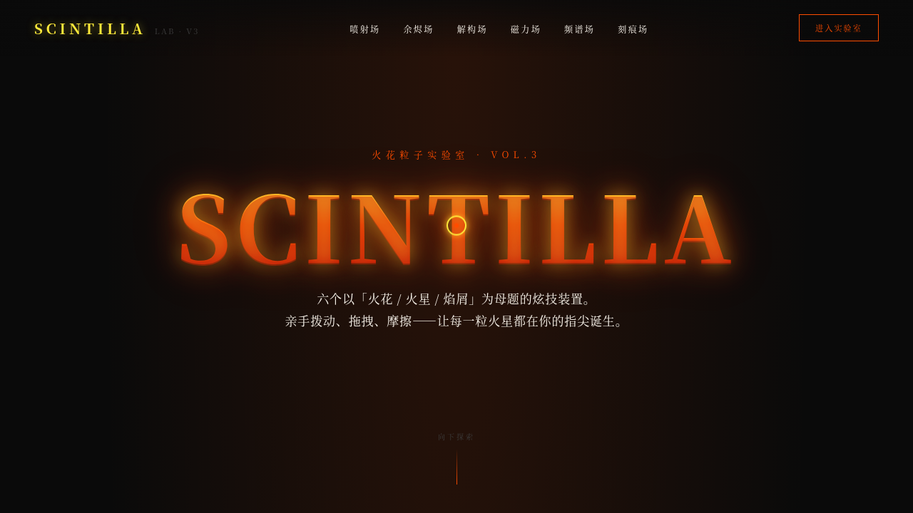

# SCINTILLA 火花粒子实验室

> 日期：2026-08-17 ｜ 方向：V3 UX 交互设计 ｜ 主题：火花/火星/焰屑特效装置馆

## 简介

一个以「火花/火星/焰屑」为核心母题的炫技特效实验室，6 个可亲手把玩的组件级装置。配色取黑夜打铁花：玄黑底 + 电焰橙 + 白热黄。纯 vanilla 单文件实现，无框架/CDN 依赖。

## 截图

## 动效亮点

6 个独立展区——火花喷射粒子场（抛物线+阻尼+迸溅）、余烬热对流（500 粒+鼠标推开）、打火石文字解构（像素采样+弹簧回复）、磁力熔渣按钮（128 点反平方引力形变）、频谱火焰可视化（32 柱高斯双层）、火花拖尾刻痕（三层辉光+速度粗细）。自定义光标白热黄+电焰橙多层发光。

## 在线预览

https://dcniaqwtmoca.feishu.cn/page/TOlqmtPJBdwC9eaL48vc9k5bn16

## 文件说明

| 文件 | 说明 |
|---|---|
| index.html | 完整可运行纯 vanilla 单文件源码 |
| 设计规范.md | 色彩/字体/展区结构/动效/物理模型 |
| thumbnail.png | 页面截图预览 |
| README.md | 本说明 |

## 技术栈

纯 vanilla HTML/CSS/JS 单文件，无 React/Babel/CDN 依赖，零外部 src 引用。
