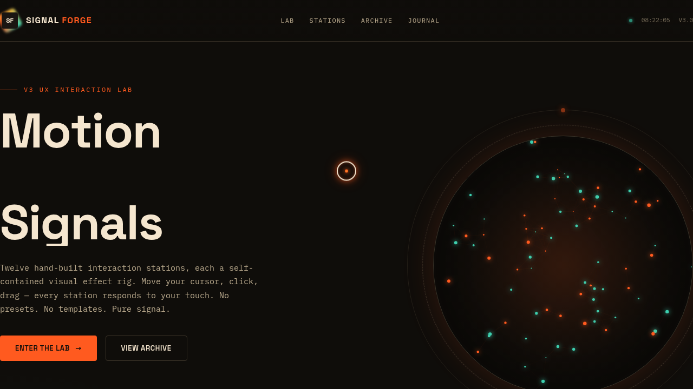

# SIGNAL FORGE 信号锻造实验室

> 日期：2026-08-17 · 方向：V3 UX 交互设计 · 主题：复古未来主义信号处理实验室（炫技组件特效动画）

## 简介

「SIGNAL FORGE」是一个可亲手把玩的信号处理实验室，12 个展区各为独立的、视觉冲击力强的组件级特效装置：粒子星座、噪波流场、文字解构、磁力形变、频谱分析、CRT 终端、3D 倾斜卡、涟漪池、存在脉冲、信号打字机、数字计数、体积光。每个展区必须上手操作才有意义。

## 截图

## 动效亮点

- 180 粒子星座（引力/斥力/涡旋三模式，光标驱动）
- Simplex 噪波流场 tracer 粒子
- 逐字符弹簧物理文字解构（Hooke 定律 + 光标排斥）
- 反平方磁力形变、CRT 扫描线磷光矩阵雨、体积光径向光柱
- 自定义光标开页即显示于屏幕中央，三态悬停切换 + 点击涟漪

## 文件说明

| 文件 | 说明 |
|---|---|
| index.html | 完整可运行源码（纯 vanilla 单文件） |
| preview.png | 页面截图 |
| thumbnail.png | 缩略图 |
| 设计规范.md | 色彩/字体/展区/动效规范 |

## 妙搭在线预览

https://dcniaqwtmoca.feishu.cn/page/QVromtCKMdwxr5agmSxckwQJnHg

## 技术栈

纯 vanilla HTML/CSS/JS 单文件（无 React / 无 Babel / 无外部 CDN 依赖）。
