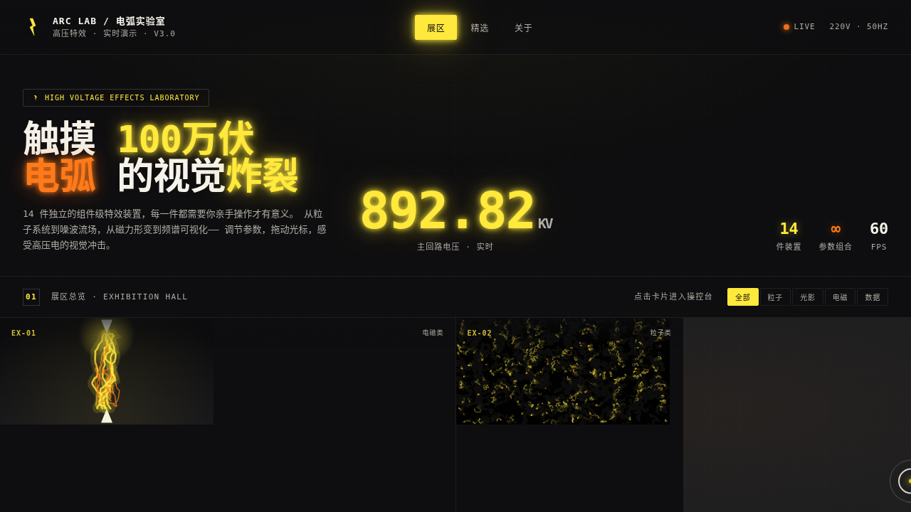

# VOLT 电弧特效实验室

> 日期：2026-08-17 ｜ 方向：V3 UX 交互设计 ｜ 主题：高压电弧 / 特斯拉线圈 / 电网

## 简介

以炫技组件特效动画为展品的高压电弧实验室，14 件独立可交互特效装置，每件上手操作才有意义。炭黑 + 电弧黄 + 瓷白 + 铜橙的高压电弧色系。

## 动效亮点

14 件特效装置：高压电弧、噪波流场、文字解构、磁力网格、频谱可视化、光标拖尾、流体粒子 Metaball、CRT 扫描线、神光散射、视差星层、模拟电压表、等离子球、火花矩阵、磁力示波器。自定义光标开页即居中显示。全部基于物理模型 / 主题语义，无整图缩放。

## 截图

## 妙搭在线预览

https://dcniaqwtmoca.feishu.cn/page/QIPnmeuL5d8dKXaxfZXcmBoKnmd

## 文件说明

| 文件 | 说明 |
|---|---|
| index.html | 单文件完整源码（纯 vanilla HTML/CSS/JS） |
| 设计规范.md | 色彩 / 字体 / 展区清单 / 健壮性 |
| preview.png | 实验室截图 |
| README.md | 本说明 |

## 技术栈

纯 vanilla HTML/CSS/JS 单文件，无 React / Babel / CDN 依赖。
