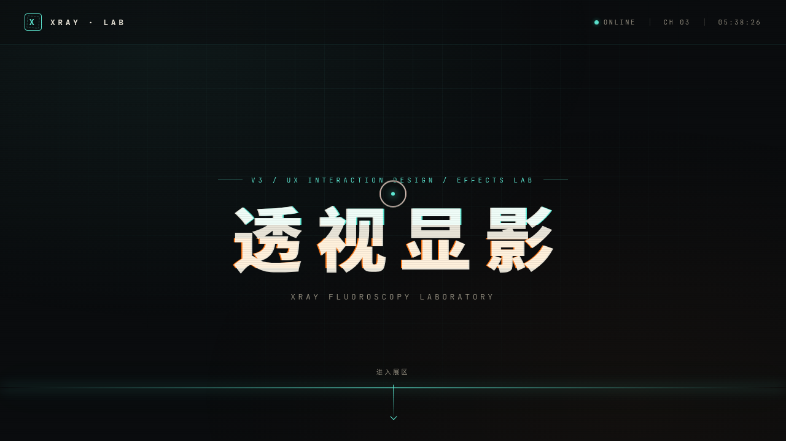

# XRAY 透视显影实验室

> 日期：2026-08-17 ｜ 方向：V3 UX 交互设计 ｜ 主题：X 光透视 / 显影炫技实验室

## 简介

以「X 光透视 / 显影」为母题的炫技组件特效实验室——12 件可亲手把玩的独立组件级特效装置（X 光扫描显影 / 热力伪彩 / 频闪残影 / 文字层析 / 扫描线 HUD / 骨骼粒子 / 噪波流场 / 频谱可视化等），每个展区上手操作才有意义。碳黑 + 骨白 + 透视青 + 警示橙的深色高对比配色。

## 动效亮点

- 自定义光标：开页居中，白环 + 透视青内点 + 多层发光，三态切换 + 涟漪
- 12 件展区装置全部基于物理模型或显影主题语义
- 统一 RAF 注册系统：`visibilitychange` 暂停 / `beforeunload` 取消
- 支持 `prefers-reduced-motion`

## 文件说明

| 文件 | 说明 |
|------|------|
| index.html | 完整可运行源码（纯 vanilla 单文件，无 React/Babel/CDN） |
| 设计规范.md | 色彩、字体、展区装置、动效原理规范 |
| thumbnail.png | 页面截图 |

## 妙搭在线预览

https://dcniaqwtmoca.feishu.cn/page/MWeYmVh5odop57ax4dIcE7S1nBb

## 技术栈

纯 vanilla HTML/CSS/JS 单文件，无 React / 无 Babel / 无外部 CDN 依赖（字体除外）。
