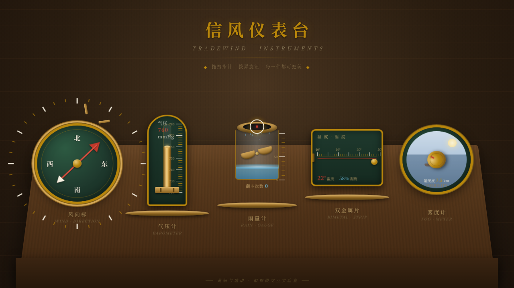

# 信风仪表台 Tradewind Instruments

> 日期：2026-08-17 · 方向：V3 UX 交互设计 · 主题：光标驱动的拟物化航海气象仪表交互实验室

## 简介

一组拟物化航海 / 气象黄铜仪表的可把玩实验室。每个展区是一件独立的、有场景叙事的拟物化微交互装置，必须用鼠标光标上手操作（悬停 / 点击 / 拖拽）才有意义：风向标、气压计、雨量计、温湿度双金属片、雾度计。黄铜 + 墨绿 + 朱红的航海仪表配色，木纹台面弧形陈列。

## 截图

## 动效亮点

- 自定义黄铜光标：开页即居中显示，悬停放大、拖拽变色、点击涟漪。
- 风向标：拖拽红色指针，八方位磁吸归位 + 弹簧回弹，风车叶片转速随角度变化。
- 气压计：拖动铜拨杆，水银柱联动 + 柱面反光，松手回弹到整 5 刻度。
- 雨量计：点击翻斗倒水，水位上涨 + 水面涟漪 + 雨滴洒落。
- 双金属片：拖旋钮，SVG 路径实时弯曲形变，温湿度双读数联动。
- 雾度计：旋转旋钮，海景场景帆船 / 太阳可见度与模糊度实时渐变，棘轮刻度吸附。

共 18 处组件级特效，全部基于物理模型（弹簧 / 磁吸 / 阻尼 / 惯性 RAF 积分器）。

## 文件说明

| 文件 | 说明 |
|---|---|
| index.html | 完整可运行源码（纯 vanilla 单文件，无外部依赖） |
| 设计规范.md | 色彩 / 字体 / 圆角 / 装置 / 动效规范 |
| preview.png | 页面截图 |
| README.md | 本说明 |

## 妙搭在线预览

https://dcniaqwtmoca.feishu.cn/page/UyLXmqTvVd9RLIa6Mu3cbe9Kn0g

## 技术栈

纯 vanilla HTML/CSS/JS 单文件（无 React / 无 Babel / 无外部 CDN 依赖），SVG + Canvas + DOM transform。支持 `prefers-reduced-motion` 降级。
