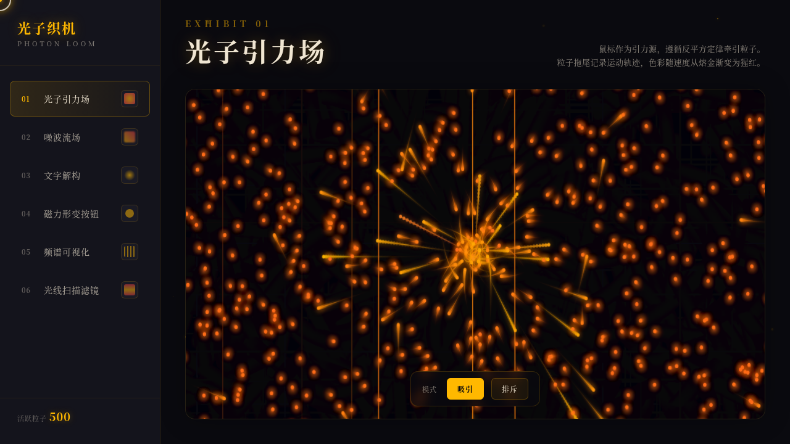

# 光子织机 · Photon Loom

> 日期：2026-08-17 · 方向：V3 UX 交互设计 · 主题：光与粒子特效可交互实验室

## 简介

「光子织机」是一个以炫技组件特效动画为展品的可交互实验室。6 个独立展区分别展示光子引力场、噪波流场、文字解构、磁力形变、频谱可视化、光线扫描滤镜——每个展区都是一个视觉冲击力强的组件级特效装置，必须上手操作才能体验完整效果。黑曜石底色+熔金/猩红/余烬橙的配色体系营造出高对比、戏剧性的视觉氛围。

## 截图

## 设计说明

- **配色**：黑曜石（#0a0a0f）背景，熔金（#ffb800）主色，猩红（#e63946）强调，余烬橙（#ff6b1a）辅助
- **粒子变色梯度**：余烬橙（低速）→ 熔金（中速）→ 猩红（高速）
- **字体**：Georgia / Noto Serif SC（衬线体增强戏剧感）
- **纯 vanilla 实现**：无 React/Babel/CDN 依赖，单文件零白屏风险

## 动效亮点

1. **光子引力场** — 500 粒子反平方引力，拖尾轨迹，速度变色
2. **噪波流场** — Simplex noise 矢量场驱动 600 粒子，鼠标扰动
3. **文字解构** — 字符像素化分解，聚拢/吹散两种风场
4. **磁力形变按钮** — clip-path 波纹形变 + 三层磁吸环 + 点击爆发粒子环
5. **频谱可视化** — 正弦叠加假频谱 + 镜像倒影 + 峰值缓降
6. **光线扫描滤镜** — 滑块控制扫描线 + 色散/故障/热成像三模式
7. **自定义光标** — 白色粗环+熔金内点+多层发光，开页即显示在屏幕中央

## 妙搭在线预览

https://dcniaqwtmoca.feishu.cn/page/QjUGmiSN3d410aaReppcJWFYnyh

## 文件说明

| 文件 | 说明 |
|------|------|
| `index.html` | 完整可运行源代码（纯 vanilla HTML/CSS/JS 单文件） |
| `preview.png` | 页面截图 |
| `thumbnail.png` | 缩略图 |
| `设计规范.md` | 设计规范文档 |

## 技术栈

- 纯 vanilla HTML/CSS/JS（无 React/Babel/CDN 依赖）
- Canvas 2D API（粒子系统/流场/频谱）
- CSS clip-path（磁力形变）
- SVG（扫描线滤镜）
- RAF + visibilitychange（动画生命周期管理）
