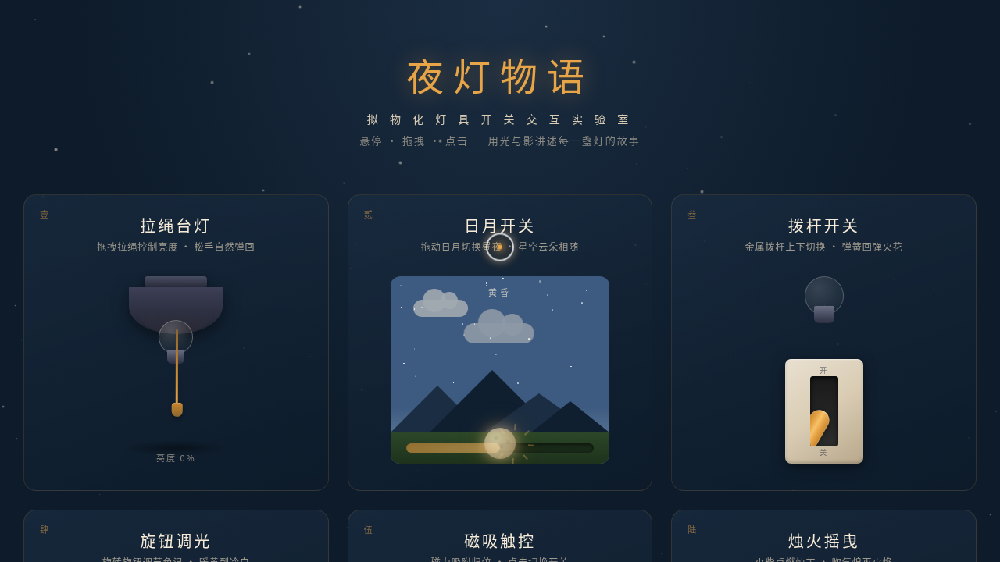

# 夜灯物语 Nightlight Tales · 拟物化灯具开关交互实验室

> 日期：2026-08-17 · 方向：V3 UX 交互设计 · 主题：拟物化灯具开关微交互

## 简介

夜灯物语是一个以「光标驱动的拟物化小组件动画」为展品的可把玩实验室。六个展区各自呈现一个有场景叙事的灯具开关微交互装置——从拉绳台灯到烛火摇曳，每个装置都需用鼠标光标上手操作（悬停/点击/拖拽），交互反馈细腻、有物理质感。

## 截图

## 动效亮点

- **拉绳单摆摆动**：胡克定律 + 单摆运动 + 微扰气流
- **灯泡光晕粒子**：亮度驱动粒子密度
- **日月天空色值插值**：全量色值线性插值，昼夜过渡
- **拨杆弹簧回弹**：过冲衰减模型 + 火花粒子喷发
- **旋钮惯性阻尼**：角速度衰减 + 27 格刻度联动
- **磁力线脉冲**：反平方距离 + 脉冲扩散
- **烛火多频摇曳**：多频正弦叠加湍流 + 余烬上升 + 烟雾扩散
- **自定义光标**：白环+琥珀金内点+发光，开页即显示在屏幕中央

## 六大展区

| 展区 | 核心交互 | 物理模型 |
|------|---------|---------|
| 壹·拉绳台灯 | 拖拽拉绳控制亮度，松手回弹 | 弹簧胡克定律 + 单摆 |
| 贰·日月开关 | 拖动滑块切换昼夜 | 色值插值 + 星空闪烁 |
| 叁·拨杆开关 | 上下拨动切换档位 | 弹簧过冲衰减 + 火花 |
| 肆·旋钮调光 | 旋转转盘调节亮度色温 | 阻尼惯性 + 刻度联动 |
| 伍·磁吸触控 | 灯泡靠近底座吸附 | 反平方磁力 + 阻尼 |
| 陆·烛火摇曳 | 火柴点燃，点击熄灭 | 多频正弦湍流 + 粒子 |

## 文件说明

| 文件 | 说明 |
|------|------|
| index.html | 完整可运行源码（纯 vanilla HTML/CSS/JS） |
| preview.png | 页面截图 |
| 设计规范.md | 色彩系统、字体、组件、动效规范 |
| README.md | 本文件 |

## 妙搭在线预览

https://dcniaqwtmoca.feishu.cn/page/WGv0mgqRFdrgAYaHWVWcYdypnBg

## 技术栈

纯 vanilla HTML/CSS/JS 单文件，零外部 CDN 依赖。Canvas 2D 粒子系统，SVG 路径动画，RAF 物理积分器，visibilitychange 暂停 / prefers-reduced-motion 降级。
