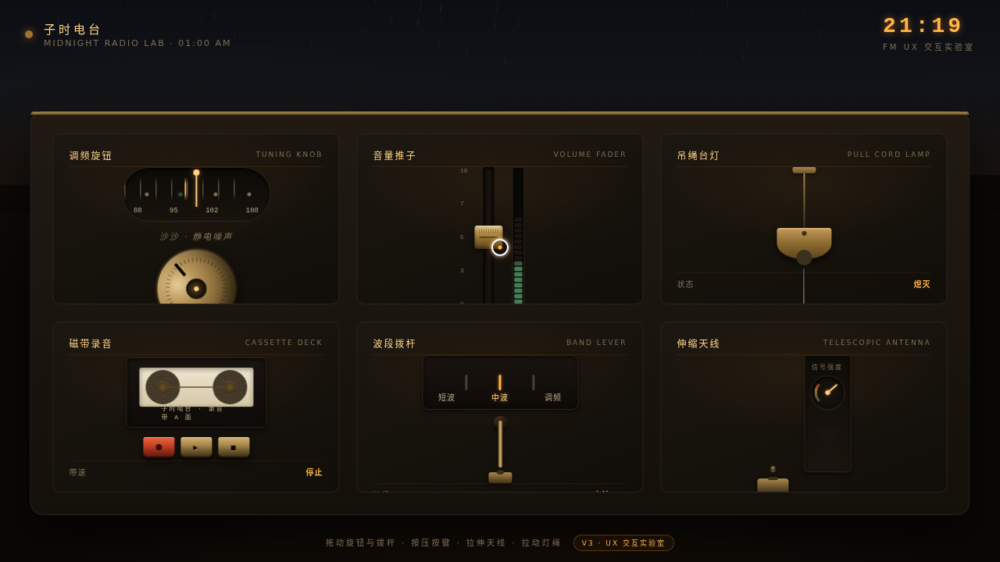

# 子时电台 · 拟物化微交互实验室

> 日期：2026-08-17 · 方向：V3 UX 交互设计 · 主题：深夜广播器材室拟物化微交互实验室

## 简介

「子时电台」是一间凌晨一点的深夜广播器材室，每个展区是一件可光标上手操作的拟物化微交互装置：调频旋钮、音量推子、吊绳台灯、磁带录音键、波段拨杆、伸缩天线。炭黑为底、琥珀暖光为主、黄铜金属质感、墨绿真空管指示灯点缀。所有交互基于弹簧/惯性/阻尼物理模型，鼠标光标悬停/点击/拖拽触发细腻微反馈。

## 动效亮点

- 调频旋钮拖拽旋转 + 刻度反向滚动 + 电台磁性吸附 + LED 亮起
- 磁带双轮惯性转动（加速/缓停）
- 吊绳台灯光线扩散与场景阴影变化
- 自定义光标三态（hover 放大变色 / dragging 转墨绿 / 点击涟漪）
- 雨丝飘落、窗户灯火闪烁、时钟、VU 电平表弹跳

## 文件说明

| 文件 | 说明 |
|---|---|
| index.html | 完整可运行源码（纯 vanilla HTML/CSS/JS 单文件） |
| 设计规范.md | 色彩/字体/展区/动效/光标规范 |
| thumbnail.png | 页面截图 |

## 妙搭在线预览

https://dcniaqwtmoca.feishu.cn/page/DS3smvoNZd2hrCaiUsjc99EXnVc

## 技术栈

纯 vanilla HTML/CSS/JS 单文件，无 React / 无 Babel / 无外部 CDN 依赖。
