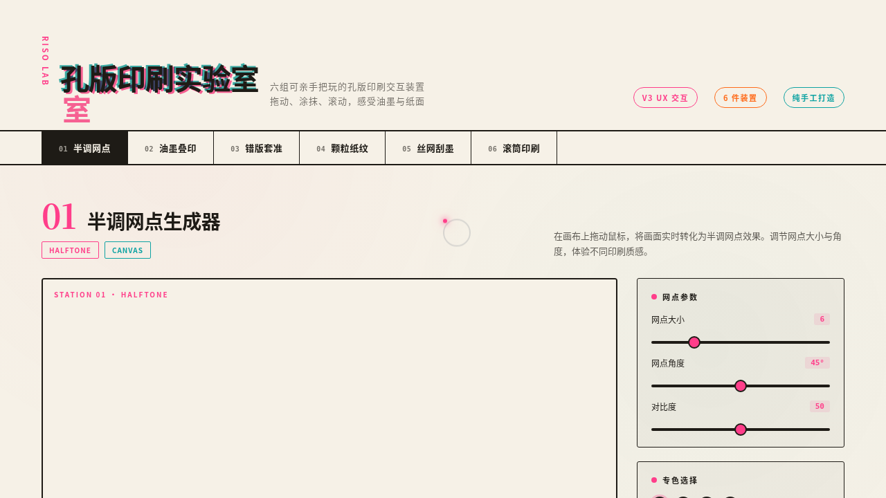

# RISO 孔版印刷特效实验室

> 日期：2026-08-17 ｜ 方向：V3 UX 交互设计 ｜ 主题：孔版油印（Risograph）美学组件特效实验室

## 简介

以孔版油印（Risograph）美学为母题的组件特效实验室。6 个展区均为可亲手把玩的视觉冲击装置：半调网点生成器、油墨叠印混色、错版套准台、颗粒纸纹噪波、丝网刮墨拖尾、滚筒印刷机。每个展区必须上手操作才有意义，围绕印刷语义构建特效。

## 截图

## 动效亮点

- 自定义光标：白环 + 荧光洋红内点 + 多层发光，开页即居中显示，悬停放大变色，点击橙色涟漪。
- 半调网点实时涂抹生成（可调大小 / 角度 / 对比度）。
- 三层专色油墨 multiply 叠印混色。
- 错版套准拖动偏移、颗粒纸纹动态噪波、丝网刮墨速度驱动油墨厚度、滚筒转速决定转印浓度。

## 文件说明

| 文件 | 说明 |
|---|---|
| `index.html` | 完整可运行源码（纯 vanilla HTML/CSS/JS 单文件，无外部依赖） |
| `preview.png` | 页面截图 |
| `thumbnail.png` | 缩略图 |
| `设计规范.md` | 色彩 / 字体 / 展区 / 动效 / 健壮性规范 |

## 在线预览

[RISO 孔版印刷实验室 妙搭应用](https://dcniaqwtmoca.feishu.cn/page/UQu3ms33GdMxA8aGew0czYU4nfe)

## 技术栈

纯 vanilla HTML/CSS/JS 单文件，无 React / 无 Babel / 无外部 CDN 依赖。
