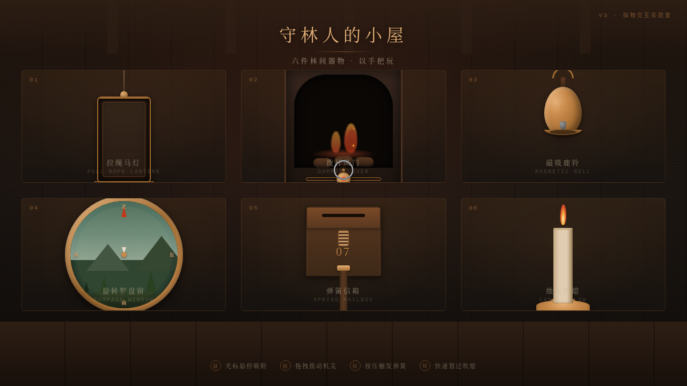

# 守林人的小屋·拟物实验室

> 日期：2026-08-17 · 方向：V3 UX 交互设计 · 主题：光标驱动的拟物化小组件动画

## 简介

「守林人的小屋」是一座林间小屋里的拟物装置实验室，每件展区都是屋内可上手操作的实体物件。拉绳马灯向下拖拽点亮、火焰光晕扩散；拨杆风门左右拨动调节火焰档位并溅出火星；磁吸鹿铃靠近被反平方引力吸附、快速划过摇响；旋转罗盘窗拖拽旋转带动林景平移与色温变化；弹簧信箱按住下沉松开回弹、信件翻转弹出；烛火快速划过被吹熄、缓慢靠近光晕被推开。整体暖木棕 + 黄铜金 + 炉膛橙红 + 羊绒米的小屋质感。

## 动效亮点

- 自定义光标（白环 + 黄铜内点 + 发光），开页居中显示，悬停放大变色、拖拽缩小、点击涟漪
- 拉绳弹簧下垂回弹、马灯光晕扩散与墙面光影
- 火焰径向缩放抖动 + 火星粒子阻尼上升
- 鹿铃反平方磁吸偏转 + 摆动阻尼衰减
- 罗盘旋转惯性 + 林景平移视差 + 色温插值
- 信箱弹簧按压回弹 + 信件 3D 翻转
- 烛火气流倾斜 + 青烟粒子

## 配色

暖木棕 `#2E1E14` / 黄铜金 `#C98A4B` / 炉膛橙红 `#D94F2B` / 羊绒米 `#E8DCC8` / 炭黑 `#171310`。

## 文件说明

| 文件 | 说明 |
|------|------|
| `index.html` | 应用入口（内联 CSS + JS，纯 vanilla 单文件） |
| `thumbnail.png` | 页面截图 |
| `设计规范.md` | 色彩 / 字体 / 装置 / 动效规范 |

## 妙搭在线预览

https://dcniaqwtmoca.feishu.cn/page/DJdBmKpOHdcfSEa5tRTc57e3nbT

## 技术栈

纯 vanilla HTML / CSS / JS，RAF 主循环驱动物理，零外部 CDN 依赖，单文件内联。
