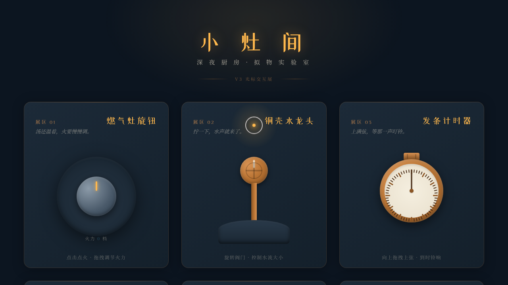

# 小灶间 · 深夜厨房拟物化组件实验室

> 日期：2026-08-17 · 方向：V3 UX 交互设计 · 主题：深夜小食堂拟物化微交互装置

## 简介

「小灶间」是一座深夜厨房的拟物化组件实验室，六个展区各是一件可上手把玩的微交互装置：拧燃气灶旋钮点火调火、旋转铜壳水龙头看水流与涟漪、给发条计时器上弦等铃响、按住胡椒研磨器画圈洒颗粒、拖拽冰箱磁贴便签感受磁吸回弹、下拉吊绳点亮暖灯。每个装置都有物理质感与场景叙事，鼠标光标悬停 / 点击 / 拖拽才有意义。

## 动效亮点

- 燃气灶旋钮：拖拽调 0–6 档 + 蓝色火焰多层呼吸
- 铜壳水龙头：水滴粒子下落 + 水槽涟漪扩散 + 水位上升
- 发条计时器：上弦蓄力 + 指针倒走 + 到时铃响震动
- 胡椒研磨器：画圈旋转 + 颗粒重力洒落
- 冰箱磁贴：拖拽 + 弹簧回弹磁吸归位 + 双击翻面
- 吊绳拉灯：下拉触发 + 暖光扩散 + 墙面阴影
- 自定义光标：白环 + 暖黄内点 + 多层发光，开页居中

## 配色

午夜蓝黑 `#14202B` / 暖黄灯 `#FFB84D` / 铜色 `#B87333` / 奶油白 `#F5EFE0`。

## 文件说明

| 文件 | 说明 |
|------|------|
| `index.html` | 完整可运行源码（纯 vanilla 单文件） |
| `thumbnail.png` | 页面截图 |
| `设计规范.md` | 色彩 / 字体 / 组件 / 动效规范 |

## 在线预览

[小灶间 · 妙搭预览](https://dcniaqwtmoca.feishu.cn/page/JORCm5SJkdcN83aRaNxcfWbnnuf)

## 技术栈

纯 vanilla HTML/CSS/JS 单文件，无 React / 无 Babel / 无外部 CDN 依赖。
